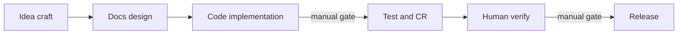

# Agentic Hub dev loop — eCanvas template

## Reference

Mirror the structure of the existing **[eCanvas dev loop](http://localhost:3000)** template (`cmr04m5rt0000f5qfn1yf22na`): 6 serial nodes, **`local-file` ports** for docs/artifacts, **`text` ports** only for branch names and URLs, human gates on implementation → test and verify → release.



Do **not** copy eCanvas-specific commands (`cd server && pnpm dev`, Vercel deploy). Adapt every node description to agentic-hub conventions from [AGENTS.md](AGENTS.md), [docs/tech/development/getting-started.md](docs/tech/development/getting-started.md), and [DEPLOYMENT.md](DEPLOYMENT.md).

## Template metadata

| Field | Value |
|-------|--------|
| **Title** | `Agentic Hub dev loop` |
| **Description** | End-to-end feature development for agentic-hub: idea → docs → Rust/UI implementation → test & review → human verify → GitHub release. Primary I/O is repo-relative file paths (`local-file`), not inline text. |

## Repo binding

One repo entry — the heart of downstream agent context:

```json
{
  "id": "agentic-hub",
  "path": "~/Developer/agentic-hub",
  "instruction": "Agentic Hub — Tauri 2.x desktop app for managing shared agentic capabilities (skills, agents, rules) across Codex, Claude Code, Cursor, OpenClaw, and ~/.agents. Rust domain crate agentic-core owns all FS mutations; React+Vite+Zustand UI is a thin IPC view. Layout: crates/agentic-core/, crates/agentic-hub/, src/, src-tauri/capabilities/. Read AGENTS.md, ARCHITECTURE.md (+ ARCHITECTURE.projection.md / .permissions.md / .workspace.md as needed), PRODUCT.md, DESIGN.md before any node. Docs: docs/features/, docs/tech/modules/, docs/tech/development/. Dev: pnpm tauri dev. Tests: cargo test --workspace, cargo clippy --all, pnpm test (Vitest stores), pnpm lint; ts-rs regen via cargo test -p agentic-core --features=ts-export. Hard rules: plan-then-apply FS, no tauri-plugin-shell, every IPC command in src-tauri/capabilities/default.json, RELEASE.md holds current release only (replace on cut), branch naming [agent]/[slug]-YYYY-MM-DD. Release: tag v* on main → .github/workflows/release.yml → draft GitHub Release (.dmg + Tauri updater on R2) per DEPLOYMENT.md."
}
```

## Node design (adapted from eCanvas dev loop)

### n1 — Idea craft

- **Skill:** `/product-idea-elaborate`
- **Flow:** Read `PRODUCT.md`, `ARCHITECTURE.md`, user prompt; confirm scope with human; write `docs/idea/<slug>.md` (or update existing idea doc).
- **Ports:**
  - Input: `feature-prompt` (text, optional)
  - Output: `product-idea` (local-file, required)
  - Context: `repo-context` — `PRODUCT.md`, `ARCHITECTURE.md` (local-file, optional)

### n2 — Docs design

- **Skills:** `/docs-designer` + `/tech-system-design`
- **Flow:** From product-idea → `docs/features/<slug>.md` + `docs/tech/modules/<slug>.md` (or `docs/tech/<slug>.md`); update root specs only when scope demands it.
- **Ports:**
  - Input: `product-idea` (local-file)
  - Output: `feature-spec`, `tech-design` (local-file, required)
  - Context: `architecture` → `ARCHITECTURE.md` (local-file, optional)

### n3 — Code implementation

- **Skills:** `/feature-dev` + `/tdd` (+ repo skill `rust-best-practices` for core changes)
- **Flow highlights specific to agentic-hub:**
  1. Branch: `[agent]/[slug]-YYYY-MM-DD` (never `main`)
  2. **Rust-first** for FS/projection work in `crates/agentic-core/` (TDD: failing test → implement → refactor)
  3. UI only after IPC contract stable; regenerate TS types when Rust shared types change
  4. New IPC: types in core → `#[tauri::command]` wrapper → register handler → add to `src-tauri/capabilities/default.json` → `src/ipc/` wrapper
  5. Propose test plan to human before running suites
  6. Write `.ecanvas/dev-log-<slug>.md`; set node `human-confirm` before n4
- **Ports:**
  - Inputs: `feature-spec`, `tech-design` (local-file)
  - Outputs: `branch` (text), `dev-log`, `implementation-handoff` (local-file)

### n4 — Test & code review

- **Skill:** `/code-review` (optionally `/security-review` when touching path validation, capabilities, or FS applier)
- **Prerequisite:** n3 human-approved
- **Commands (repo root, not server/client split):**

```bash
cargo test --workspace
cargo clippy --all-targets --all-features --locked -- -D warnings
pnpm test
pnpm lint
```

- Write `.ecanvas/test-results-<slug>.md` and `.ecanvas/code-review-<slug>.md`
- **Ports:** inputs `branch`, `dev-log`, optional `implementation-handoff`; outputs `test-results`, `code-review-report` (local-file)

### n5 — Human verify

- **Human gate only** — no agent skill
- **Flow:** `pnpm tauri dev`; walk acceptance criteria from `feature-spec`; optional `pnpm test:e2e` if feature touches UI flows; record outcome in `.ecanvas/verification-<slug>.md` or text entity; `human-confirm` before n6. Loop back to n3/n4 on failure.
- **Ports:** inputs `test-results`, `code-review-report`, optional `feature-spec`; output `verification-result` (text | local-file)

### n6 — Release

- **Skills:** `/ship` → `/document-release` → `/deploy` (adapt deploy step to agentic-hub, not Vercel)
- **Prerequisite:** n5 approved
- **Adapted release flow:**
  1. `/ship` — PR to `main`, pre-landing review, version bump across `package.json`, `crates/agentic-hub/Cargo.toml`, `tauri.conf.json`
  2. `/document-release` — **replace** [RELEASE.md](RELEASE.md) (current release only), append [CHANGELOG.md](CHANGELOG.md), sync docs
  3. Merge PR, tag `v<version>` on main, push tag → GitHub Actions builds universal `.dmg` + updater artifacts (see [DEPLOYMENT.md](DEPLOYMENT.md)); publish draft release manually
- **Ports:** inputs `verification-result`, `branch`; outputs `pr-url` (text), `release-notes` (local-file → `RELEASE.md`), `deploy-status` (local-file summary)

## Edge guards (same pattern as eCanvas dev loop)

| Edge | Guard |
|------|-------|
| n1 → n2 | `all-outputs-present` |
| n2 → n3 | `all-outputs-present` |
| n3 → n4 | `manual` (post-implementation human confirm) |
| n4 → n5 | `all-outputs-present` |
| n5 → n6 | `manual` (post-verify human confirm) |

Node positions: horizontal chain at x = 0, 400, 800, 1200, 1600, 2000 (y = 0) for readable graph layout.

## API authoring sequence (after plan approval)

Per [create-ecanvas-template skill](file:///Users/arno/.agents/skills/ecanvas/create-ecanvas-template/SKILL.md):

1. **Pre-flight:** `ECANVAS_TOKEN` is already set; `GET /templates` confirms no duplicate title.
2. **Create (gated):** Show user title + node summary; on approval `POST /api/v1/agent/templates` with empty workflow shell.
3. **Patch incrementally** (json-patch, threading `revision`):
   - Add `repos[0]`
   - Add nodes n1–n6 one or two at a time
   - Add edges e1–e5
4. **Read back:** `GET /templates/:id` and present plain-language summary + template id for future `run-ecanvas` instances.
5. **Optional:** Add `.ecanvas.json` bookmark in agentic-hub repo root on first run (handled by `run-ecanvas`, not template authoring).

## What we are explicitly not doing

- No Vercel / server+client split references
- No 9-node branding/data-watcher loop (per your scope choice)
- No file writes in agentic-hub repo during template authoring — template lives on eCanvas server only

## Success criteria

- New template visible in `GET /templates` with title **Agentic Hub dev loop**
- 6 nodes, 5 edges, 1 repo binding; all doc I/O uses `local-file`
- Node descriptions cite correct agentic-hub commands, paths, and release mechanics
- User approved create before POST
