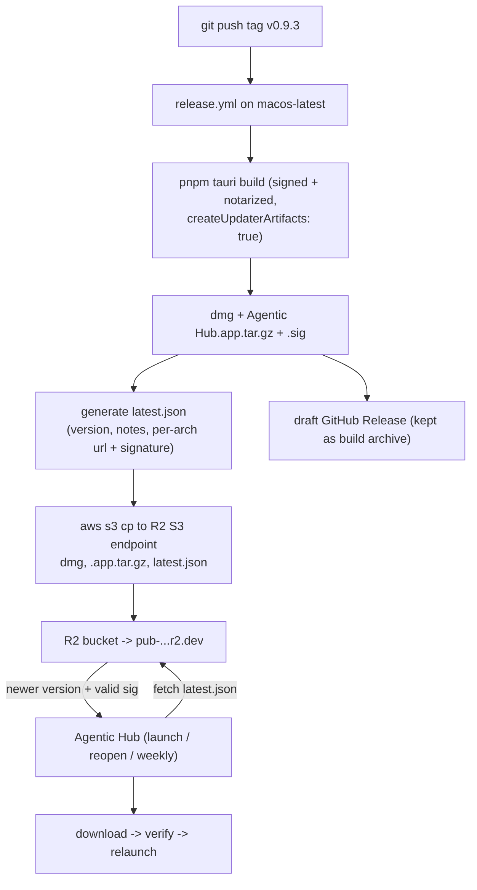

# Auto-update for Agentic Hub via Cloudflare R2

Add a self-updater to the Tauri app (`agentic-hub` v0.9.2, macOS universal, already signed + notarized) using Tauri's **built-in updater**. Host the update feed (`latest.json`) and the signed `.app.tar.gz` on **Cloudflare R2** behind the public URL `https://pub-96a02606d38546a2a0d158c71c45d99b.r2.dev`. Extend [release.yml](/Users/ArnoYe/Developer/agentic-hub/.github/workflows/release.yml) so a `v*` tag builds, signs, and **auto-syncs** to R2.

## Why Tauri updater (not Sparkle)
Sparkle targets native Swift/AppKit apps. This is a Tauri shell, so Tauri's updater is the supported path: a `latest.json` manifest + a `minisign`-signed `.app.tar.gz`, with the public key embedded in the app. The R2 hosting, custom URL, and GitHub Actions pipeline you described stay identical — only the updater engine differs. Tauri's signature layer plays the same integrity role you wanted from Sparkle's EdDSA (minisign is Ed25519).

## Release + update flow

## App-side changes (Rust + frontend)

- **Dependencies** in [crates/agentic-hub/Cargo.toml](/Users/ArnoYe/Developer/agentic-hub/crates/agentic-hub/Cargo.toml): add `tauri-plugin-updater = "2"` and `tauri-plugin-process = "2"` (process plugin enables the relaunch after install).
- **Config** in [crates/agentic-hub/tauri.conf.json](/Users/ArnoYe/Developer/agentic-hub/crates/agentic-hub/tauri.conf.json):
  - `bundle.createUpdaterArtifacts: true` (emits `.app.tar.gz` + `.sig`).
  - `plugins.updater`: `endpoints: ["https://pub-96a02606d38546a2a0d158c71c45d99b.r2.dev/latest.json"]` and `pubkey: "<minisign public key>"`.
- **Plugin registration** in [crates/agentic-hub/src/lib.rs](/Users/ArnoYe/Developer/agentic-hub/crates/agentic-hub/src/lib.rs): `.plugin(tauri_plugin_updater::Builder::new().build())` and `.plugin(tauri_plugin_process::init())`.
- **Capabilities** in [crates/agentic-hub/capabilities/default.json](/Users/ArnoYe/Developer/agentic-hub/crates/agentic-hub/capabilities/default.json): add `"updater:default"` and `"process:allow-restart"`.
- **Signing keypair**: generate with `pnpm tauri signer generate` once. Public key goes in `tauri.conf.json`; private key + password become CI secrets. Keep the private key out of git.

### Update logic (follows the store-first architecture)
- New `@tauri-apps/plugin-updater` + `@tauri-apps/plugin-process` in [package.json](/Users/ArnoYe/Developer/agentic-hub/package.json).
- Wrap `check()`, `downloadAndInstall()`, `relaunch()` in [src/ipc.ts](/Users/ArnoYe/Developer/agentic-hub/src/ipc.ts) (the only place that talks to Rust per AGENTS.md).
- New `src/state/updateStore.ts` (Zustand): `checkForUpdate()`, `downloadAndInstall()`, state (`available`, `version`, `notes`, `downloading`, `error`), and a persisted `lastCheckedAt` (via `tauri-plugin-store`). Unit-tested with Vitest, mocking `@/ipc` (TDD: write the store tests first).
- **Triggers** (throttled to once per ~weekly window using `lastCheckedAt`):
  - On app load (frontend mount).
  - On window re-open — hook the existing `RunEvent::Reopen` path in `lib.rs` to emit an event the store listens for, or re-check on main-window focus.
  - A weekly `setInterval` safety net.
- **UX**: when an update is found, show a `sonner` toast / small dialog ("Update to vX available") with Install. On install, download → verify signature (automatic) → `relaunch()`. Optional: a "Check for Updates" item in [menu](/Users/ArnoYe/Developer/agentic-hub/crates/agentic-hub/src/menu.rs).

## CI changes ([release.yml](/Users/ArnoYe/Developer/agentic-hub/.github/workflows/release.yml))
- Add to the build step env: `TAURI_SIGNING_PRIVATE_KEY` and `TAURI_SIGNING_PRIVATE_KEY_PASSWORD` (so `tauri build` signs the `.app.tar.gz`).
- New step **generate `latest.json`** from build outputs: read `Agentic Hub.app.tar.gz.sig`, the version, and `RELEASE.md` notes; write per-arch entries `darwin-aarch64` and `darwin-x86_64` (both pointing at the universal `.app.tar.gz` on R2).
- New step **sync to R2** via `aws s3 cp` against `https://0bddfbb8b8cbf54e867f8c77b55f9cc6.r2.cloudflarestorage.com` (S3-compatible): upload the `.dmg`, the `.app.tar.gz`, and `latest.json`.
- Keep the existing draft GitHub Release (build archive / changelog source).

### One-time manual setup (cannot be done by the MCP)
- In Cloudflare: create an **R2 API token** (S3 access key + secret) with object write on the bucket.
- Add repo secrets: `TAURI_SIGNING_PRIVATE_KEY`, `TAURI_SIGNING_PRIVATE_KEY_PASSWORD`, `R2_ACCESS_KEY_ID`, `R2_SECRET_ACCESS_KEY`; repo variable `R2_BUCKET` (the bucket bound to the `pub-...r2.dev` domain — I'll confirm its name via the R2 MCP `r2_buckets_list`).

## Docs
- Update [DEPLOYMENT.md](/Users/ArnoYe/Developer/agentic-hub/DEPLOYMENT.md): add an "Auto-update + R2" section (artifacts, R2 layout, `latest.json` schema, secrets, cut-a-release steps incl. R2). Add `CHANGELOG.md` entry under `[Unreleased]`.

## Notes / caveats
- `r2.dev` is cached at the edge; a new `latest.json` can take a short while to propagate (fine for weekly checks). A custom domain later gives finer cache control.
- Universal build: both arch keys in `latest.json` point at the single universal `.app.tar.gz`.
- The macOS updater needs the app signed (already done) — Gatekeeper rejects an unsigned replacement.
- This is the **app** self-updater; it's separate from the existing in-app *skill* update window (`cmd_open_update_window`).

## Verification
- `cargo test --workspace` + `cargo clippy --all-targets --all-features --locked -- -D warnings` green.
- `pnpm test` green (new `updateStore` tests).
- Dry-run the manifest+sync logic; confirm `latest.json` is reachable at the r2.dev URL and a stale-version build offers the update.