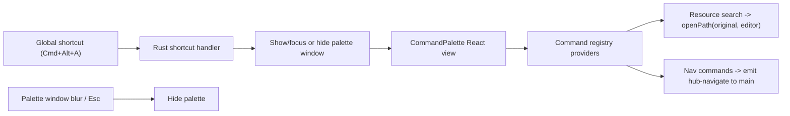

## Command Palette (Alfred-style)

### Goal
A floating, always-on-top panel summoned anywhere via a global shortcut (default `Cmd+Alt+A`). v1 does flat resource search (Enter opens the original file in the selected editor); the result list is fed by an extensible command-provider registry so new commands (install skills, switch suites) drop in later. Also add native top menus, with `Cmd+,` opening Config.

### Architecture decisions (confirmed)
- Dedicated floating window (label `palette`), not an in-app overlay — works while the Hub is backgrounded.
- New dependency `tauri-plugin-global-shortcut` (Tier-1 add).
- New persisted `Settings.paletteShortcut` field (Tier-1 schema change, ts-rs regen).

### Activation flow

### Backend (Rust shell + core)
- `crates/agentic-core/src/settings.rs`: add `#[serde(default = "default_palette_shortcut")] pub palette_shortcut: String` (default `"Cmd+Alt+A"`); update `Default for Settings`. Add a small unit test for the default + a parse-validation helper.
- `crates/agentic-hub/Cargo.toml`: add `tauri-plugin-global-shortcut = "2"`.
- [crates/agentic-hub/src/lib.rs](crates/agentic-hub/src/lib.rs):
  - Init the global-shortcut plugin and, in `setup`, create the hidden `palette` window (decorations off, transparent, always-on-top, skip taskbar, centered) and register the configured shortcut to toggle it.
  - Build a native `Menu` (App submenu with About, Settings `Cmd+,`, Hide, and `PredefinedMenuItem::quit` to preserve the Cmd+Q hard-exit; Edit submenu; Window submenu; a "Go" submenu with a Command Palette item). Wire `on_menu_event`: Settings -> show/focus `main` + emit `menu-open-config`; Command Palette -> toggle palette.
  - Extend `on_window_event`: when the `palette` window loses focus (`WindowEvent::Focused(false)`) hide it (Alfred-like dismiss).
- [crates/agentic-hub/src/commands.rs](crates/agentic-hub/src/commands.rs):
  - In `cmd_save_settings`, re-register the global shortcut from the new settings (unregister-all then register; surface parse errors as `IpcError`).
  - Add `cmd_toggle_palette` and `cmd_show_main` (show + focus main) for menu/JS use.
- Capabilities: add `crates/agentic-hub/capabilities/palette.json` granting `core:default` (+ `core:window:allow-show/allow-set-focus`, `core:event:default`) to the `palette` window. Custom `cmd_*` are already cross-window. Update the IPC contract doc.

### Frontend (palette UI + registry)
- [src/main.tsx](src/main.tsx): branch on `getCurrentWindow().label` — render `<CommandPalette/>` for `palette`, else `<App/>`; add a `palette-window` class so `index.css` makes html/body transparent.
- New `src/components/palette/CommandPalette.tsx`: autofocused search input, keyboard nav (Up/Down/Enter, Esc hides), result rows. On a resource result, call `openPath(originalFile(item), editorApp(settings))` then hide. Re-scan on window show/focus.
- New `src/state/palette.ts` (Zustand, per AGENTS.md "logic in stores"): holds settings, scanned items, query, selectedIndex, and computes the visible `PaletteItem[]` via the registry. Unit-tested with Vitest.
- New `src/components/palette/commands.ts`: the extensible registry. Define `PaletteItem` and `CommandProvider`; ship two providers — resource flat-search (open original) and nav (Open Manager/Suites/Config via a `hub-navigate` event). Built so future providers append with no UI change.
- Refactor: move `originalFile(item)` and `editorApp(settings)` out of [src/components/manager/Matrix.tsx](src/components/manager/Matrix.tsx) into [src/shared.tsx](src/shared.tsx); reuse in both.
- [src/App.tsx](src/App.tsx): listen for `menu-open-config` and `hub-navigate` events -> navigate the main window's hash route.
- [src/components/config/ConfigPage.tsx](src/components/config/ConfigPage.tsx): add a `ShortcutPanel` to edit `paletteShortcut` (accelerator text input, default `Cmd+Alt+A`, hint about format); save -> `saveSettings` triggers backend re-registration.

### Types / IPC
- Regen: `cargo test -p agentic-core --features ts-export` updates `src/types/generated/Settings.ts` with `paletteShortcut`.
- Add `togglePalette`/`showMain` wrappers in [src/ipc.ts](src/ipc.ts) and the `menu-open-config` / `hub-navigate` event listeners.

### Tests (ask before running per feature-dev)
- Vitest: `src/state/palette.ts` — filtering, selection wrap-around, registry ordering.
- Rust: `settings.rs` default shortcut + accelerator parse-validation.

### Docs & release
- New `docs/features/command-palette.md`; update `ARCHITECTURE.md` (new `palette` window, global shortcut, native menu, blur-dismiss in the window-lifecycle section) and `docs/tech/modules/tauri-ipc-contract.md`.
- Append a one-line `RELEASE` entry; tag after merge per the feature-dev SOP.

### Out of scope (registry stubs only)
Install-skills-from-vendor and switch-suites commands are left as registry extension points, not implemented in v1.
</plan>
<todos>[{"id": "settings-field", "content": "Add Settings.paletteShortcut (Rust default + ts-rs regen) with unit test for default + accelerator validation helper"}, {"id": "deps-window", "content": "Add tauri-plugin-global-shortcut, create hidden floating palette window, register/toggle shortcut, blur-to-hide, palette capability json"}, {"id": "native-menu", "content": "Add native macOS menus: App submenu with Settings (Cmd+,) and preserved Quit, Edit/Window, and a Command Palette menu item; wire menu events"}, {"id": "resync-shortcut", "content": "Re-register global shortcut in cmd_save_settings; add cmd_toggle_palette and cmd_show_main"}, {"id": "palette-ui", "content": "Route main.tsx by window label; build CommandPalette.tsx + usePaletteStore with search, keyboard nav, Esc/blur dismiss, transparent styling"}, {"id": "command-registry", "content": "Build extensible command registry: resource flat-search provider (open original) + nav provider; structure for future providers"}, {"id": "shared-extract", "content": "Extract originalFile/editorApp from Matrix.tsx into shared.tsx and reuse in palette + manager"}, {"id": "config-nav", "content": "Add ShortcutPanel to ConfigPage; wire menu-open-config and hub-navigate event listeners in App.tsx and ipc.ts"}, {"id": "tests", "content": "Vitest palette store tests + Rust settings shortcut tests (ask before executing test plan)"}, {"id": "docs-release", "content": "Add docs/features/command-palette.md, update ARCHITECTURE.md + IPC contract doc, append RELEASE entry, open MR and tag"}]</todos>
</invoke>
