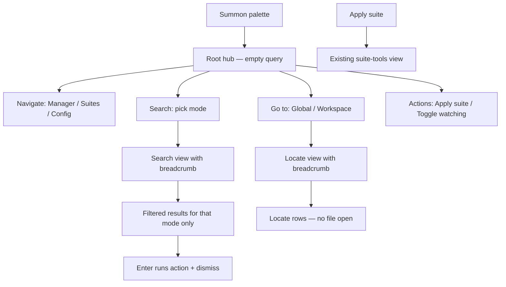

# Layered Command Palette

## Problem

Today the palette mixes behaviors at root ([`commands.ts`](src/components/palette/commands.ts)):

- **Empty query** dumps all suites + nav rows (noisy, not categorized).
- **Any typed query** runs all providers at once (resources, commands, workspace, suites, nav) — a global search the user did not ask for.
- **Missing actions**: toggle watching, locate in **global** scope (workspace locate exists via `hub-locate`).

The suite-tools drill-in ([`palette.ts`](src/state/palette.ts) `PaletteView`) is the right pattern to extend.

## Target UX



### Root hub (empty query)

Grouped first-class rows (section headers in UI, not mixed global results):

| Section | Rows |
|---------|------|
| **Search** | Search all resources · Search skills · Search agents · Search rules · Search hooks · Search commands · Search suites |
| **Go to** | Go to global · Go to workspace |
| **Navigate** | Open Manager · Open Suites · Open Config |
| **Actions** | Apply suite… · Toggle watching (label reflects current state: Pause / Resume) |

### Root hub (typed query, strict mode-only)

Per your choice: **only filter hub rows** (section titles + row titles/subtitles). No resource/workspace/suite results until the user drills into a mode.

### Search modes (drill-in, `dismissOnRun: false`)

Each mode gets a breadcrumb (`‹ Search skills`) and context placeholder. Backspace on empty query steps back to root (same as suite-tools).

| Mode | Results | Enter action |
|------|---------|--------------|
| `all` | all non-command resources | `openPath` |
| `skill` / `agent` / `rule` / `hook` | filtered by `kind` | `openPath` |
| `command` | commands only | copy body; Alt+Enter open file |
| `suite` | suites by name/desc | drill → existing `suite-tools` view |

Empty query inside a search mode: show nothing (or a short hint — no dump of entire tree).

### Go-to / locate modes

| Mode | Results | Enter action |
|------|---------|--------------|
| `global` | global inventory items | locate in Manager **global** scope |
| `workspace` | workspace inventory items (all remembered projects) | existing `hub-locate` flow |

These reuse the same substring matcher but **never open files** — they surface the row in the matrix.

### Keyboard / navigation (unchanged semantics, extended views)

- `Backspace` on empty query in any drill-in view → `back()` to parent (search → root; suite-tools → root).
- `Esc` → hide palette.
- Breadcrumb button → `back()` (already exists for suite-tools).

---

## Architecture changes

### 1. Extend `PaletteView` ([`src/state/palette.ts`](src/state/palette.ts))

```typescript
export type SearchMode =
  | "all" | "skill" | "agent" | "rule" | "hook" | "command" | "suite"
  | "global" | "workspace";

export type PaletteView =
  | { kind: "root" }
  | { kind: "search"; mode: SearchMode }
  | { kind: "suite-tools"; suiteId: string; suiteName: string };
```

Store additions:

- `enterMode(mode: SearchMode)` — switch view, clear query, recompute (mirror `enterSuite`).
- `back()` — pop one level: `suite-tools → root` (today goes root directly; adjust to `search/suite → root` when entered from suite search mode, or keep suite-tools → root as today).
- `recompute()` branches on `view.kind` to call `computeHubResults` vs `computeSearchResults` vs `computeSuiteToolResults`.

### 2. Refactor command registry ([`src/components/palette/commands.ts`](src/components/palette/commands.ts))

Replace flat `PROVIDERS` root composition with three functions:

- **`computeHubResults(ctx)`** — root hub only; returns categorized drill-in rows + terminal nav/action rows. Uses new `PaletteItem` fields if needed:
  - `section?: string` for UI grouping (e.g. `"Search"`, `"Navigate"`).
  - existing `dismissOnRun: false` for drill-ins.
- **`computeSearchResults(ctx, mode)`** — single-mode provider logic extracted from today's `resourceSearchProvider`, `commandSearchProvider`, `workspaceSearchProvider`, `suiteApplyProvider`.
- **`computeSuiteToolResults`** — unchanged.

Remove root-level global `flatMap(PROVIDERS)` — that is the behavior we're eliminating.

**Watching toggle** (new hub action):

- Read `settings.watcherEnabled` on summon.
- `run: () => setWatcherEnabled(!enabled)` via existing [`ipc.ts`](src/ipc.ts) `setWatcherEnabled`.
- Emit new cross-window event `hub-watcher-changed` so [`manager.ts`](src/state/manager.ts) `watching` stays in sync without requiring `showMain`.
- `dismissOnRun: true` (terminal action).

### 3. Global locate IPC ([`src/ipc.ts`](src/ipc.ts), [`App.tsx`](src/App.tsx))

Generalize locate payload (backward-compatible):

```typescript
export type LocateRequest =
  | { scope: "workspace"; workspaceId: string; itemId: string }
  | { scope: "global"; itemId: string };
```

- Palette `global` mode: `emitHubLocate({ scope: "global", itemId })`.
- Palette `workspace` mode: `emitHubLocate({ scope: "workspace", workspaceId, itemId })` (same as today).
- **App listener**: `scope === "global"` → `setScope("global")`, `navigate("manager")`, `setLocate(itemId)` (raw id, no `ws::` prefix). Workspace branch keeps current behavior.

Update [`docs/tech/modules/tauri-ipc-contract.md`](docs/tech/modules/tauri-ipc-contract.md) event section.

No Rust changes — events are WebView-only.

### 4. UI ([`src/components/palette/CommandPalette.tsx`](src/components/palette/CommandPalette.tsx))

- **Breadcrumb** for any `view.kind !== "root"` (not only suite-tools): `‹ Search skills`, `‹ Go to workspace`, etc.
- **Section headers** at root when `section` changes between adjacent rows (muted label row, non-selectable).
- **Placeholders** per view:
  - root: `Search commands or pick an action…`
  - search modes: `Search skills…` / `Search all resources…`
  - locate modes: `Find in global…` / `Find in workspace…`
  - suite-tools: unchanged
- **Empty states**:
  - root + no hub matches: `No matching commands.`
  - search/locate + empty query: `Type to search.`
  - search/locate + no matches: `No matches.`

Keep existing layout tokens ([`layout.ts`](src/components/palette/layout.ts), popover styling).

---

## Docs (before implementation)

Use `docs-designer` to update:

- [`docs/features/command-palette.md`](docs/features/command-palette.md) — layered hub UX, mode table, strict root typing, new actions, updated flow diagram.
- [`docs/tech/modules/tauri-ipc-contract.md`](docs/tech/modules/tauri-ipc-contract.md) — `hub-locate` scope union + `hub-watcher-changed` event.

---

## Tests (propose before running)

| Suite | What to add |
|-------|-------------|
| [`commands.test.ts`](src/components/palette/commands.test.ts) | hub lists sections on empty query; root query filters hub only (no resource rows); each search mode filters by kind; global locate calls correct payload; watching toggle flips enabled |
| [`palette.test.ts`](src/state/palette.test.ts) | `enterMode` / `back` view stack; breadcrumb pop on empty backspace |

Run: `pnpm test` (palette + commands), no Rust changes expected.

---

## Delivery

1. Branch: `feat/palette-layered-search-20260610`
2. Design docs update
3. State + registry refactor (core behavior)
4. IPC + App listener for global locate + watcher sync
5. UI polish (sections, breadcrumbs, placeholders)
6. Tests (after approval)
7. One-line [`RELEASE.md`](RELEASE.md) entry
8. PR to `main`

## Out of scope (this slice)

- Fuzzy ranking / recency (still substring match per existing v1 contract)
- Prefix directives (`> skills`) at root
- Install-from-vendor provider stub
- Per-section keyboard shortcuts (1–9)
