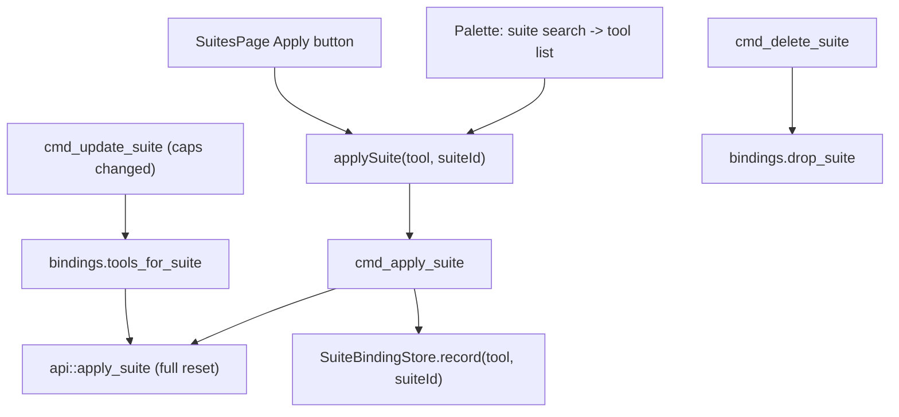

# Palette Suite Apply + Suite<->Tool Binding

## Goal

Three coordinated changes, built on the existing full-reset pipeline (`api::apply_suite`):

1. **Palette level-2 flow** — search suites by name, drill into a suite, apply it to one tool (full clean+replace) and close.
2. **Audit + test the apply strategy** — prove the clean/replace logic is exact (links, managed copies, markdown rules, hooks).
3. **Suite<->tool binding** — persist which suite is applied to each tool; when a suite's capabilities change, re-apply (full reset) to every bound tool automatically; drop bindings on suite delete.

Branch: `feat/palette-suite-apply-binding-20260603`.

## Architecture

## 1. Core: suite<->tool binding store (new)

- New `crates/agentic-core/src/model.rs` type `SuiteBinding { tool_id: ToolId, suite_id: String }` (ts-export, camelCase). One binding per tool (full reset => a tool reflects exactly one suite).
- New file `crates/agentic-core/src/suite_binding_store.rs`, modeled on [`workspace_target_store.rs`](crates/agentic-core/src/workspace_target_store.rs):
  - On-disk envelope `{ version, bindings: Vec<SuiteBinding> }` at `~/.agentic-hub/suite-bindings.json` (atomic tmp+rename; missing file => empty; malformed => `StateParse` error, never overwrite).
  - `with_path` ctor for tests; `read`, `record(tool, suite_id)` (upsert by tool), `tools_for_suite(suite_id) -> Vec<ToolId>`, `drop_suite(suite_id)`.
- Register `mod suite_binding_store;` in [`lib.rs`](crates/agentic-core/src/lib.rs).
- Tests (TDD): record upserts per tool, re-record same tool replaces suite, `tools_for_suite` filters, `drop_suite` removes, missing-file empty, malformed-not-overwritten.

## 2. Core: harden + test apply_suite, add binding resync helper

- Audit [`api::apply_suite`](crates/agentic-core/src/api.rs) (lines ~201-231): already a correct full reset — `desired[id] = suite.contains(id)` for every scanned item, then `build_plan`/`apply` (removes non-suite links/copies) + `sync_rules` + `sync_hooks` (rewrite blocks to exactly the suite set), `force=false` (never takes over real files). Keep as-is.
- Add a thin helper `apply_suite_to_tools(items, settings, suite, tools: &[ToolId]) -> Vec<ApplySuiteResult>` that loops `apply_suite` per tool — the testable core of the binding resync.
- New `cargo test` cases in `api.rs` proving clean/replace accuracy:
  - re-apply with a smaller suite removes the dropped skill's managed copy/link (extend existing `apply_suite_full_reset_*`).
  - markdown rules block contains exactly the suite's rules; a previously-synced rule is gone after re-apply.
  - hooks json section reflects exactly the suite's hooks.
  - empty suite disables everything for the tool.
  - re-apply refreshes a stale managed copy (replace path).
  - `apply_suite_to_tools` applies to each listed tool independently.

## 3. Shell: wire bindings into the suite commands

In [`crates/agentic-hub/src/commands.rs`](crates/agentic-hub/src/commands.rs):

- `cmd_apply_suite`: after a successful `api::apply_suite`, call `SuiteBindingStore::new().record(tool, suite_id)`. (Palette and SuitesPage both flow through here, so both bind.)
- `cmd_update_suite`: after `suite_store.update(...)`, load settings + `api::scan`, read `tools_for_suite(id)`, run `api::apply_suite_to_tools` for those tools, then emit `suite-store-changed` and `sources-changed` so the main window refreshes. Serialize against the watcher by reusing the existing reconcile guard (expose a small `watcher::with_reconcile_guard(||...)` wrapper) to avoid concurrent writes to the same tool dirs.
- `cmd_delete_suite`: after remove, `SuiteBindingStore::new().drop_suite(id)`.

## 4. Type codegen

- Run `cargo test -p agentic-core --features=ts-export` to emit `src/types/generated/SuiteBinding.ts`; export it from the types barrel if present.

## 5. Palette: two-level view + providers

- [`src/components/palette/commands.ts`](src/components/palette/commands.ts):
  - Add `dismissOnRun?: boolean` to `PaletteItem` (default true; suite rows set `false` to navigate without closing).
  - Extend `ProviderContext` with `suites: SuiteDefinition[]` and a `view`/`enterSuite(id,name)` callback.
  - `suiteApplyProvider` (root view): match suites by name; each item `run()` => `enterSuite(...)`, `dismissOnRun: false`, group `Suite`.
  - In the suite-tools view, build tool rows from enabled+available tools; each `run()` => `applySuite(tool, suiteId)` (terminal, closes). Group `Apply`.
- [`src/state/palette.ts`](src/state/palette.ts):
  - Load `listSuites()` alongside settings+scan in `load`.
  - Add `view: { kind: "root" } | { kind: "suite-tools"; suiteId; suiteName }`, actions `enterSuite`, `back`; `reset` returns to root.
  - `recompute` branches on view: root => providers; suite-tools => tool rows for that suite.
  - `runSelected` returns the run item so the component knows whether to dismiss.

## 6. Palette UI

- [`src/components/palette/CommandPalette.tsx`](src/components/palette/CommandPalette.tsx):
  - `runAndHide` hides only when the executed item's `dismissOnRun !== false`.
  - In suite-tools view: show a `‹ Back` breadcrumb (suite name) and update the placeholder ("Apply <suite> to a tool…"); Backspace on an empty query => `back()`; Esc still hides.

## 7. UI tests (Vitest)

- `src/state/palette.test.ts` (new): suite search yields suite rows; `enterSuite` switches to suite-tools view; tool rows list available tools; running a tool row calls `applySuite(tool, suiteId)` and is terminal; running a suite row navigates and does not dismiss; `back`/`reset` return to root. Mock `@/ipc` (`loadSettings`, `scan`, `listSuites`, `applySuite`).
- `src/components/palette/commands.test.ts` (new): `suiteApplyProvider` matches by name; tool provider lists enabled/available tools.

## 8. Docs, release, MR

- Update [`docs/features/command-palette.md`](docs/features/command-palette.md): move suite-apply out of "Out of scope" into the implemented flow; document the two-level UX.
- New `docs/tech/modules/suite-bindings.md`; update [`docs/tech/modules/tauri-ipc-contract.md`](docs/tech/modules/tauri-ipc-contract.md) for the new `cmd_apply_suite`/`cmd_update_suite`/`cmd_delete_suite` side effects (no new IPC surface — palette reuses `listSuites`/`applySuite`).
- Add a one-line `RELEASE.md` entry.
- Gates: `cargo test --workspace`, `cargo clippy --all-targets --all-features --locked -- -D warnings`, `pnpm test`, `pnpm lint`. Open MR to `main`.

## Decisions (confirmed)

- Palette applies a suite to **one** tool per step (Enter on a tool applies + closes).
- Bindings live in a new `~/.agentic-hub/suite-bindings.json`; suite Save re-applies to bound tools; suite Delete only drops bindings (no tool wipe).
- Workspace patches keep their existing binding/watcher replay — the new binding covers global-scope tools only.