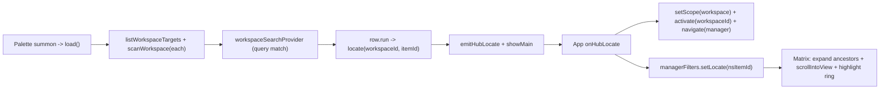

# Workspace search and locate in the command palette

Combine [workspace-inventory.md](docs/features/workspace-inventory.md) with [command-palette.md](docs/features/command-palette.md): a new palette provider searches the user-added workspaces' inventories, and selecting a result surfaces (locates) that row in the Hub's workspace matrix.

This is pure UI/TS. The palette already calls `cmd_*` cross-window (no plugin permission needed), and `hub-locate` is a generic Tauri event reusing the `core:event` permissions already in [palette.json](crates/agentic-hub/capabilities/palette.json). No Rust changes.

## Data flow

## Changes

### 1. New cross-window event — [src/ipc.ts](src/ipc.ts)
Add a `hub-locate` event mirroring the existing `hub-navigate` pair (around lines 53-59):
- `emitHubLocate(payload: { workspaceId: string; itemId: string })` -> `emit("hub-locate", payload)`.
- `onHubLocate(cb)` -> `listen<...>("hub-locate", ...)`.

### 2. Centralize the workspace id prefix — [src/shared.tsx](src/shared.tsx)
Move `WORKSPACE_ID_PREFIX = "ws::"` out of [manager.ts](src/state/manager.ts) (line 114) into `shared.tsx` and export it. The manager keeps using it; the locate handler reconstructs the namespaced matrix-row id from the raw inventory item id.

### 3. Load workspace inventories in the palette — [src/state/palette.ts](src/state/palette.ts)
- Extend state with `workspaces: { target: WorkspaceTarget; items: CapabilityItem[] }[]`.
- In `load()`, after settings, also `listWorkspaceTargets()` then `Promise.allSettled(targets.map(t => scanWorkspace(t.id)))` so one bad project never breaks summon; keep only fulfilled inventories.
- Add a stable `locate(workspaceId, itemId)` callback (like `navigate`): `void emitHubLocate({ workspaceId, itemId }).then(showMain)`.
- Thread `workspaces` + `locate` into the `ProviderContext` in `recompute`.

### 4. Workspace search provider — [src/components/palette/commands.ts](src/components/palette/commands.ts)
- Extend `ProviderContext` with `workspaces` and `locate`.
- Add `workspaceSearchProvider`: returns nothing on an empty query (same as `resourceSearchProvider`); otherwise matches each workspace's items by `name / relativePath / sourceLabel`, mapping to a `PaletteItem` with `group: "Workspace"`, `title: it.name`, `subtitle: \`${target.label} · ${it.relativePath}\``, and `run: () => locate(target.id, it.id)`.
- Register it in `PROVIDERS` right after `resourceSearchProvider` so a query surfaces global and workspace hits together.

### 5. Locate target in matrix filters — [src/state/managerFilters.ts](src/state/managerFilters.ts)
Add a transient `locateId: string` (the namespaced row id) + `setLocate(id)` / `clearLocate()`. In-memory only, consistent with the existing filter state.

### 6. Surface the row — [src/components/manager/Matrix.tsx](src/components/manager/Matrix.tsx)
- Read `locateId` from `managerFilters`.
- A `useEffect` keyed on `[locateId, data]`: find the item, expand its ancestor folder paths (drop them from `collapsed`) so a tree-collapsed row becomes visible, `scrollIntoView({ block: "center" })` via a ref attached only to the located leaf row, then `clearLocate()` after ~2s.
- In `leafRow`, attach the ref and a transient highlight ring (e.g. `ring-2 ring-primary`) when `item.id === locateId`.

### 7. Handle locate in the main window — [src/App.tsx](src/App.tsx)
Add an `onHubLocate` listener next to `onHubNavigate` (lines 68-75):
- `useManagerStore.getState().setScope("workspace")`
- `await useWorkspaceStore.getState().activate(workspaceId)` (sets active + loads that inventory into the manager store)
- `navigate("manager")`
- `useManagerFiltersStore.getState().setLocate(WORKSPACE_ID_PREFIX + itemId)`

The Matrix effect then expands/scrolls/highlights once both the inventory and `locateId` are present.

## Tests
- [src/components/palette/commands.test.ts](src/components/palette/commands.test.ts): add a `workspaceSearchProvider` block — empty query yields nothing; a query filters by name/path; `run()` calls `locate(workspaceId, itemId)`; rows carry `group: "Workspace"`. Add `workspaces`/`locate` to the test `ctx()` helper.
- [src/state/palette.test.ts](src/state/palette.test.ts): mock `listWorkspaceTargets` + `scanWorkspace`; assert `load()` populates `workspaces` and that a failed `scanWorkspace` is skipped (allSettled), not fatal.
- [src/state/manager.test.ts](src/state/manager.test.ts) / managerFilters: small test that `setLocate`/`clearLocate` round-trips.

## Docs
- [docs/features/command-palette.md](docs/features/command-palette.md): add workspace search + locate to scope and "How it works" (new `hub-locate` event, `workspaceSearchProvider`).
- [docs/features/workspace-inventory.md](docs/features/workspace-inventory.md): note the palette as a second entry point that locates a row.
- [docs/tech/modules/tauri-ipc-contract.md](docs/tech/modules/tauri-ipc-contract.md): document the `hub-locate` event.

## Out of scope
- Opening the workspace file from the palette (Enter only locates, per the chosen behavior).
- Fuzzy ranking / recency (v1 stays substring, matching the existing palette).