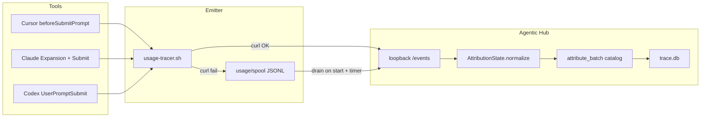

# Skill Usage Tracing Hardening Plan

## Root cause

**Primary (explains intermittent Cursor `/xxxx` misses):** Production attribution in [`crates/agentic-hub/src/usage_attribution.rs`](crates/agentic-hub/src/usage_attribution.rs) never parses `/skill-name` from prompt-submit payloads. `collect_prompt_refs` only extracts `$name` and markdown `[...](.../SKILL.md)` links:

```177:196:crates/agentic-hub/src/usage_attribution.rs
fn collect_prompt_refs(text: &str, refs: &mut Vec<SkillReference>) {
    // ... skill_link + dollar_reference only ...
}
```

Docs ([`docs/features/local-skill-usage-tracing.md`](docs/features/local-skill-usage-tracing.md), [`docs/tech/modules/local-usage-tracing.md`](docs/tech/modules/local-usage-tracing.md)) and legacy tests still claim “validated slash-skill” support, but those slash parsers live only under `legacy_normalization` in [`crates/agentic-hub/src/usage_collector/tests.rs`](crates/agentic-hub/src/usage_collector/tests.rs) — **dead code relative to the live collector path**. Lost in the v0.15.1 multi-skill split (`usage_attribution` / `usage_catalog`).

Tracking “sometimes works” when Cursor also emits Skill tool / Read `SKILL.md` / `$skill` / attachment; it fails when the only signal is `/name` in `beforeSubmitPrompt`.

**Secondary silent misses:** hook script curls with `--max-time 0.5` and `|| true` ([`usage_collector/hooks.rs`](crates/agentic-hub/src/usage_collector/hooks.rs)); collector down / token mismatch / app quit → no DB row, no retry.



## What “every conversation step” means (this plan)

Stay inside the existing privacy model (prompts never persisted; no free-form transcript inference).

| Step | Signal | Status after fix |
|------|--------|------------------|
| User submits `/skill` or `$skill` | `UserPromptSubmit` / `beforeSubmitPrompt` | Restore catalog-validated `/` + keep `$` / links / attachments |
| Claude expands slash command | `UserPromptExpansion.command_name` | Already works |
| Mid-turn Skill tool | `PostToolUse` `tool_name=Skill` | Already works |
| Mid-turn Read of `SKILL.md` | `PostToolUse` Read path | Already works |
| Same skill multiple times in one turn | `invocation_key` + rank upgrade | Already works |
| Agent free-form “I’ll use X” / transcript replay | — | **Out of scope** (unchanged) |

## Target design decisions (fixed)

1. **Restore slash extraction in production** with `requires_catalog_match: true` and `attribution_source = "slash_reference"`, rank `60` (above `$` 50, below path/link 70 / tool 100). Only keep tokens that match `valid_skill_name` **and** resolve uniquely in the catalog — generic `/help` is dropped, not stored as unresolved noise.
2. **Do not revive the legacy hyphen-only filter** (`token.contains('-')`). That wrongly excluded catalog skills/agents with single-segment names (e.g. `/cto`) once catalog validation is the gate.
3. **Also restore documented agent prompt signals** in the same pass: `/agentName` and `@agent-*` as catalog-validated name refs; Read of `…/agents/*.md` as path refs (feature contract already claims this; production only accepts `SKILL.md` today).
4. **Align Codex name precedence with Cursor:** unique workspace match first, then unique global (`unique(locals).or_else(unique(globals))`). Today Codex returns `None` whenever both scopes are non-empty ([`usage_catalog.rs` L326–330](crates/agentic-hub/src/usage_catalog.rs)), which under-counts repo-local skills that share a global leaf name.
5. **Fault tolerance via local spool** (no new network surface): on curl failure, append stdin + headers metadata to `~/.agentic-hub/usage/spool/*.jsonl`; collector drains on start and on a short interval; still always `exit 0`. Bump curl timeout to `1.0s` (still non-blocking for tools).
6. **No transcript/session backfill** — Session Explorer stays read-only UI; usage tracing remains hook-driven.

## Work packages

### WP1 — Production slash / agent prompt attribution (root fix)

**File:** [`crates/agentic-hub/src/usage_attribution.rs`](crates/agentic-hub/src/usage_attribution.rs)

- Extend `collect_prompt_refs` to scan whitespace tokens for `/name` → `slash_reference` (rank 60, `requires_catalog_match: true`).
- Add `@agent-` / `@name` collector → `agent_mention` (rank 60, catalog-required).
- Extend path handling so Read / attachment paths under an `/agents/` segment ending in `.md` produce agent name refs (mirror `SKILL.md` path logic; catalog already indexes `CapabilityKind::Agent` via `is_skill_or_agent`).
- Keep Claude `UserPromptExpansion` path unchanged.

**TDD first:** move/rewrite fixtures from [`usage_collector/tests/normalization.rs`](crates/agentic-hub/src/usage_collector/tests/normalization.rs) onto `AttributionState::normalize` (not `legacy_normalization`):

- Cursor `beforeSubmitPrompt` with only `/root-cause-investigation` extracts a slash ref.
- `/health` or unknown slash → empty after `attribute_batch` (catalog-required drop).
- Multi-skill turn: `/a` + `$b` + Skill tool for `c` → three occurrences; same skill twice → one after dedupe/rank.
- Codex / Claude prompt-submit slash fixtures pass on production path.

### WP2 — Catalog resolution parity (global + local + three tools)

**File:** [`crates/agentic-hub/src/usage_catalog.rs`](crates/agentic-hub/src/usage_catalog.rs)

- Change Codex branch to Cursor-style local-then-global unique resolve.
- Add/extend tests in [`usage_catalog/tests.rs`](crates/agentic-hub/src/usage_catalog/tests.rs):
  - Cursor/Claude/Codex: bare `/repo-only-skill` resolves workspace row when skill exists under documented roots.
  - Same leaf name global + local: Cursor/Codex count workspace; Claude keeps global-first (existing).
  - Ambiguous two locals same name → unresolved / dropped when `requires_catalog_match`.
- Confirm catalog still covers: managed global scan, `installed::{tool}::…`, and repo roots (`.agents/.cursor/.claude/.codex/skills` for Cursor; Claude/Codex ancestor walks unchanged).

### WP3 — Delivery fault tolerance (spool)

**Files:** [`crates/agentic-hub/src/usage_collector/hooks.rs`](crates/agentic-hub/src/usage_collector/hooks.rs), [`crates/agentic-hub/src/usage_collector.rs`](crates/agentic-hub/src/usage_collector.rs) (small helper module if needed, stay under 600 lines)

- Rewrite `usage-tracer.sh` to: try curl `1.0s`; on failure append one JSON line to `~/.agentic-hub/usage/spool/<source_tool>.jsonl` (payload + token epoch / port / source_tool); always exit 0.
- Collector: on bind success + periodic drain (e.g. every 30s while enabled), read/rename spool files, re-run `normalize` → `attribute_batch` → `insert_events`, delete only after success.
- Reject spool lines whose token does not match current settings (stale after token rotate).
- Tests: simulated curl failure leaves spool; drain inserts attributed events; bad token lines discarded without poisoning the file.

### WP4 — Kill dead harness + doc contract sync

- Delete or gut `legacy_normalization` / `legacy_capability_refs` in [`usage_collector/tests.rs`](crates/agentic-hub/src/usage_collector/tests.rs) so no test asserts slash behavior against dead code.
- Update feature + module docs acceptance language to match implemented sources: `$`, validated `/`, Skill tool, Read `SKILL.md`, Claude expansion, attachments/links, agent `/` + `@agent-*` + agents `.md` Read.
- Config diagnostics already expose unresolved counts — no UI change required unless spool backlog should surface later; **v1: no new UI**, rely on existing lastCapturedAt / unresolved.

### WP5 — Verification

- `cargo test -p agentic-hub -- usage_` (attribution + catalog + collector + spool).
- `cargo test --workspace` and `cargo clippy --all-targets --all-features --locked -- -D warnings`.
- Manual smoke (after implement): with Hub running, Cursor `/root-cause-investigation` → Manager Usage increments with `attribution_source` slash or upgraded skill_tool; quit Hub, fire one slash, restart Hub → spool drains into DB; Claude expansion and Codex `$`/`/` still count.

## Out of scope

- Free-form / transcript / Session Explorer backfill of skill use.
- Remote analytics sync.
- Kiro capture (hook may project; collector still cursor|claude|codex only).
- Changing privacy model to persist prompts.
- UI for editing/deleting usage events.

## Acceptance criteria

- Cursor prompt containing only a catalog-known `/skill` produces a counted usage row when Hub is healthy.
- Same for Codex; Claude keeps Expansion + gains slash-on-submit when catalog matches.
- Global managed, tool-installed global, and repo-local skills all resolve under existing catalog roots.
- Mid-turn Skill / Read `SKILL.md` still count and upgrade the same `invocation_key` rather than double-count.
- Collector outage during a hook does not lose the event once Hub recovers (spool drain).
- Unknown `/slash` tokens never inflate unresolved diagnostics.
- Production tests cover slash; legacy dead parsers are gone; docs match code.
