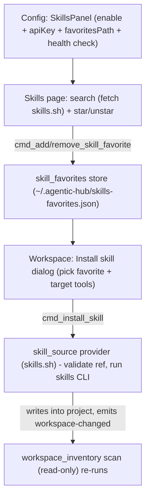

# Skills.sh as a Pluggable Workspace Skill Source

## Goal

Let a user enable skills.sh in Config, search and **star** skills locally, then from Workspace scope **install** a starred skill into a project via the skills CLI. The read-only inventory stays read-only; install is the one new, explicit, user-initiated write. Built behind a provider seam so other public sources can plug in later.

## Decisions locked

- Inventory matrix stays strictly read-only; install is a separate explicit action (the only workspace write).
- Install runs the `skills` CLI via a controlled `std::process::Command` in Rust (no `tauri-plugin-shell`). WebView calls a typed `cmd_install_skill`.
- Search/detail HTTP runs as WebView `fetch` with a user-supplied API key from Config. No Rust HTTP dependency. "Star" is local-only (skills.sh has no favorites endpoint).

## Architecture

## Rust core (`crates/agentic-core/`)

- **`settings.rs`** — add a `SkillsConfig { enabled: bool, api_key: Option<String>, favorites_path: Option<PathBuf> }` field on [`Settings`](crates/agentic-core/src/settings.rs) (`#[serde(default)]`, disabled by default; ts-export). Add `resolved_favorites_path()` mirroring `resolved_suites_path()` → default `~/.agentic-hub/skills-favorites.json`. API key is plaintext in `config.json` (local-only; note tradeoff, keychain is a follow-up).
- **`skill_favorites.rs`** (new) — favorites store, modeled on [`suite_store`](crates/agentic-core/src/suite_store.rs)/`workspace_target_store`. Types: `SkillFavorite { provider, id, slug, name, source, github_url, page_url, starred_at }`, `SkillFavoritesState { favorites }`. API: `read / add (upsert by (provider,id), LRU-ish newest-first) / remove`. Atomic tmp+rename write. TDD: add/dedupe/remove/roundtrip/custom-path.
- **`skill_source.rs`** (new) — the provider seam + install. A small `SkillProvider` trait (`id()`, `install(workspace_dir, install_ref, tools) -> SkillInstallResult`, `cli_check() -> SkillCliStatus`) with one `SkillsShProvider` impl. Pure, unit-tested bits: `validate_install_ref` (allow only `^[A-Za-z0-9._-]+(/[A-Za-z0-9._-]+)*$`, reject shell metachars) and CLI arg-vector construction. The subprocess run is thin and isolated. Types: `SkillInstallResult { ok, log, installed_count }`, `SkillCliStatus { available, version, message }`.
  - macOS PATH gotcha: a Finder-launched app has a minimal PATH, so `npx`/`skills` may be missing. Resolve by invoking through a login shell to inherit the user PATH (`/bin/zsh -lc`) while still passing the command as fixed args built from the **validated** ref — no user string interpolation. (To verify during impl: exact `skills add` flags for targeting a project dir + specific agents via `skills add --help`.)

## Rust shell (`crates/agentic-hub/`)

- **`commands.rs`** — new thin wrappers:
  - `cmd_skill_cli_check() -> SkillCliStatus`
  - `cmd_list_skill_favorites`, `cmd_add_skill_favorite(input)`, `cmd_remove_skill_favorite(input)` (resolve path from settings)
  - `cmd_install_skill(input { provider, install_ref, workspace_id, tool_ids }) -> SkillInstallResult` — resolve+validate the workspace dir against `WorkspaceTargetStore` (guard: install only into a known target), run the provider, then `watcher.restart_if_running` and `app.emit("workspace-changed")` so the inventory re-scans.
- **`lib.rs`** — register the new commands in `invoke_handler!`. (Custom `cmd_*` are window-local; per [default.json](crates/agentic-hub/capabilities/default.json) they need no plugin permission.)

## Frontend (`src/`)

- **`ipc.ts`** — wrappers for the new commands + a `skillsSearch(query)` / `skillDetail(id)` helper doing WebView `fetch` to `https://skills.sh/api/v1/...` with `Authorization: Bearer <apiKey>` from settings.
- **`types/index.ts`** — export the new generated types.
- **`state/skills.ts`** (new, Zustand) — `{ query, results, favorites, status }` + `search / star / unstar / loadFavorites / install`. Unit-tested with mocked `@/ipc` and `fetch`.
- **`components/config/ConfigPage.tsx`** — new `SkillsPanel`: enable `Switch`, API-key `Input`, favorites-path override (browse, like [`SuiteFilePanel`](src/components/config/ConfigPage.tsx)), and a "Check CLI & API" button rendering `SkillCliStatus` + an API ping result.
- **Skills page** — `components/skills/SkillsPage.tsx`: search box, results (name, source, installs, links to GitHub + skills.sh), star toggles, and a Favorites list. Add `"skills"` to [`Route`](src/shared.tsx), [`App.tsx`](src/App.tsx) `ROUTES`+render, and a **conditional** Header tab shown only when `settings.skills.enabled`.
- **Workspace install** — `components/workspace/InstallSkillDialog.tsx` opened from an "Install skill…" button in [`WorkspaceView`](src/components/workspace/WorkspaceView.tsx): pick a favorite + target tools (checkboxes from `WORKSPACE_TOOLS`), call `install`, toast result; the emitted `workspace-changed` auto-reloads the matrix.

## Docs

- New: `docs/features/skills-sh-integration.md`, `docs/tech/modules/skill-sources.md`.
- Update: [`docs/tech/modules/workspace-inventory.md`](docs/tech/modules/workspace-inventory.md) and [`ARCHITECTURE.workspace.md`](ARCHITECTURE.workspace.md) to document the explicit install write path (inventory remains read-only); [`AGENTS.md`](AGENTS.md) to amend the "workspace read-only" hard rule with the opt-in install carve-out and note the controlled-subprocess exception (still no `tauri-plugin-shell`); `docs/tech/modules/tauri-ipc-contract.md` for the new commands. Add a `RELEASE.md` line + `CHANGELOG.md` entry.

## Risks / to verify during impl

- **CORS:** WKWebView enforces CORS; if skills.sh API lacks `Access-Control-Allow-Origin` for the app origin, WebView `fetch` fails. Fallback: adopt `tauri-plugin-http` (Tauri-official proxy, bypasses CORS) — a Tier-1 dependency I'd confirm before adding.
- **CLI flags:** confirm `skills add` supports targeting a project dir + specific agents; otherwise run in the workspace cwd and reflect whatever it installs via re-scan.
- **API key required:** all skills.sh API endpoints need a key (email Vercel). Search degrades gracefully (clear prompt) when the key is absent.

## Verification

- `cargo test --workspace` and `cargo clippy --all-targets --all-features --locked -- -D warnings` green.
- `cargo test -p agentic-core --features ts-export` to regenerate TS types.
- `pnpm test` for the new `skills` store + config changes; `pnpm lint`.
- Manual: enable in Config → health check → search → star → Workspace → Install into a test project → skill appears in the inventory matrix.

## Branch & delivery

- Branch `feat/skills-sh-source-20260604`; commits on branch; RELEASE entry; regenerate types; tests; open PR to `main`.