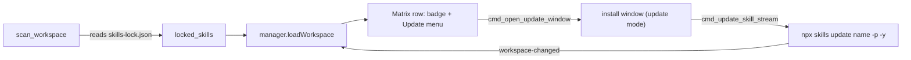

# Skills.sh Update Action in Workspace Inventory

Add two things to workspace scope: (1) a mark on inventory rows that skills.sh installed, read from the project's `skills-lock.json`, and (2) a row "..." menu action that opens the existing install window in a focused **update mode** to run `npx skills update <name> -p -y` with live streaming, then re-scan.

## Background (verified)

- skills.sh writes a project lock at `<workspace>/skills-lock.json`:

```json
{ "version": 1, "skills": { "<name>": { "source": "owner/repo", "sourceType": "github", "computedHash": "..." } } }
```

The map keys are skill folder names — these match an inventory skill item's leaf folder `name`. The `source` is the `owner/repo` install ref.
- Update CLI: `npx skills update <name> -p -y` (`-p` project scope, `-y` non-interactive). cwd = workspace dir.
- The streaming install window (`install` label) already owns: live `Channel` console, Cancel that kills the child, watcher restart + `workspace-changed` re-scan. We reuse all of it.

## Flow



## Rust core (test-first)

- New `crates/agentic-core/src/skill_lock.rs` (+ `pub mod skill_lock;` in `lib.rs`):
  - `LocalSkillLock { version, skills: BTreeMap<String, LockedSkillEntry> }`, `LockedSkillEntry { source, source_type, computed_hash }`.
  - `parse_local_lock(body) -> Result<LocalSkillLock>` (pure, tested) and `read_local_lock(ws) -> Option<LocalSkillLock>` (reads `<ws>/skills-lock.json`; missing or malformed -> `None`, never fails the scan).
- `crates/agentic-core/src/workspace_inventory.rs`:
  - Add ts-exported `LockedSkill { item_id, name, source, source_type }` and field `locked_skills: Vec<LockedSkill>` on `WorkspaceInventory`.
  - After building items, `read_local_lock(ws)`; for each `Skill` item whose leaf `name` is a lock key, push a `LockedSkill` (item_id = local `skill:<rel>` id, `source` = installRef). Tests: skill present in lock -> marked with source; skill absent from lock -> unmarked; no lock file -> empty.
- `crates/agentic-core/src/skill_source.rs`:
  - `skills_update_npx_args(name) -> ["--yes","skills@latest","update",<name>,"--project","--yes"]` and `skills_update_command(name)` (reuses `validate_skill_slug`, login PATH). Unit-test argv + program.

## Tauri bin

- `crates/agentic-hub/src/install_window.rs`:
  - Extend `InstallContext` with `update: Option<UpdateTarget { provider, install_ref, name }>` (`#[serde(default)]` keeps install path unchanged).
  - `cmd_open_update_window(workspaceId, provider, installRef, name)` — resolve target store, set `InstallContext` with `update: Some(...)`, reuse `build_install_window` + show/focus.
  - Extract the spawn/stream/finish body of `cmd_install_skill_stream` into a private helper; add `cmd_update_skill_stream({ provider, workspaceId, name }, Channel)` that validates the slug, builds `skills_update_command(name)`, and runs the same helper (same `InstallState`, Cancel, watcher restart + `workspace-changed`).
- `crates/agentic-hub/src/lib.rs` — register `cmd_open_update_window` and `cmd_update_skill_stream` in `generate_handler!`. No capability JSON change (custom `cmd_*` are cross-window, like the existing install commands).
- Regenerate TS types: `cargo test -p agentic-core --features=ts-export`.

## Frontend

- `src/ipc.ts` — add `openUpdateWindow(workspaceId, provider, installRef, name)`, `updateSkillStream({ provider, workspaceId, name }, channel)`; the generated `InstallContext` gains `update`.
- `src/state/manager.ts` — add `lockedSkills: Map<string, { name: string; source: string }>` keyed by **namespaced** item id; populate in `loadWorkspace` from `inv.lockedSkills` (apply `WORKSPACE_ID_PREFIX`). Reset to empty in `refresh` (global scope).
- `src/components/manager/Matrix.tsx`:
  - Thread `lockedSkills` and the active `workspaceId` (from `useWorkspaceStore`) into `BodyContext`.
  - In `leafRow`, when `ctx.lockedSkills.has(item.id)`, render a small `skills.sh` badge next to the name (tooltip "Installed via skills.sh").
  - In `RowActions`, when read-only and the row is locked, add a `DropdownMenuItem` "Update via skills.sh" -> `openUpdateWindow(workspaceId, "skills.sh", locked.source, locked.name)`.
- `src/components/install/InstallWindow.tsx` — when `context.update` is set, render an update panel instead of the favorites matrix: show name + installRef, a Run/Update button, Cancel, reusing the existing streaming console (`runOne`-style helper calling `updateSkillStream`). Install mode stays exactly as-is.

## Tests & docs

- Core: `skill_lock` parse (ok/empty/malformed), `workspace_inventory` lock marking, `skill_source` update argv.
- UI: extend `src/state/manager.test.ts` — `loadWorkspace` populates namespaced `lockedSkills` from a mocked inventory.
- Run `cargo test --workspace`, `cargo clippy --all-targets --all-features --locked -- -D warnings`, `pnpm test`.
- Docs: `docs/features/skills-sh-integration.md` (add update surface), `docs/tech/modules/skill-sources.md` (update command + window mode), `docs/tech/modules/workspace-inventory.md` + `ARCHITECTURE.workspace.md` (lock-aware marking; update is the second user-initiated workspace write), and a `CHANGELOG.md` `[Unreleased]` + `RELEASE.md` entry.

## Notes / decisions

- Update marking and the menu action appear only in workspace (read-only) scope; global scope is untouched (`lockedSkills` empty).
- Per-row update only; "update all skills.sh skills" is a follow-up.
- Lock parsing is tolerant (missing/malformed -> unmarked) so the read-only scan never breaks.