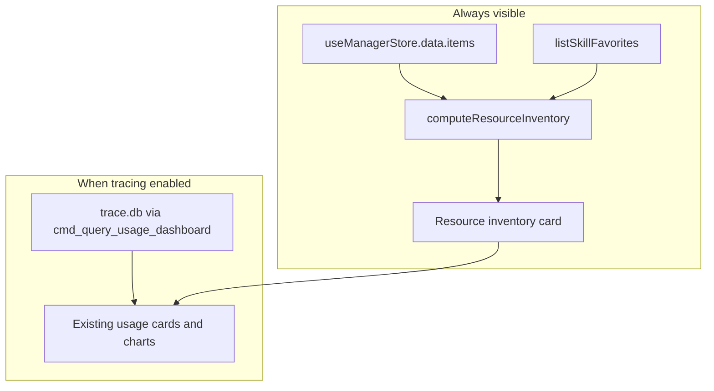

# Statistics Resource Inventory Enhancement

## Goal

The Statistics tab currently shows **usage** metrics only (and hides everything when tracing is off). Extend it with a **resource inventory** panel that answers:

1. How many agentic resources in total
2. How many skills, agents, rules, hooks, commands
3. How many agentic tools are enabled (e.g. 5 of 8)
4. How many skills are starred in Resources

This inventory is **not date-filtered** and **does not require usage tracing**.



---

## Design

### Page layout ([`src/components/statistics/StatisticsPage.tsx`](src/components/statistics/StatisticsPage.tsx))

Insert a new card **between the toolbar and the tracing alert**, always rendered when inventory data is available:

```
Toolbar (update subtitle)
├── Resource inventory          ← NEW (always)
│   ├── Row A: 4 summary tiles
│   └── Row B: 5 kind tiles
├── [Tracing-off alert]         ← only gates usage section
└── Usage overview + charts     ← rename "Overview" → "Usage overview"
```

**Row A — summary tiles** (reuse existing `StatTile` pattern):

| Tile | Value | Hint |
|------|-------|------|
| Total resources | `inventory.total` | Same count as header (`277 capabilities`) |
| Configured sources | `inventory.sourceCount` | e.g. `2 sources` |
| Enabled tools | `inventory.enabledTools` | e.g. `5 of 8` |
| Starred skills | `inventory.favoritesCount` | Link to `#/skills` |

**Row B — by kind** (5 tiles in `KIND_ORDER` from [`src/shared.tsx`](src/shared.tsx)):

| Skills | Agents | Rules | Hooks | Commands |
|--------|--------|-------|-------|----------|
| count | count | count | count | count |

Use existing kind color tokens from `KIND_BADGE_COLOR` / `DESIGN.md` semantic colors for subtle label tinting—no new chart needed for inventory (keeps the page scannable; usage charts stay below).

**Toolbar copy** — broaden subtitle from usage-only to:

> "Resource inventory and local usage from traced events."

**Section titles** — distinguish the two domains:
- `RESOURCE INVENTORY` (new)
- `USAGE OVERVIEW` (rename current Overview card)

---

## Data model and aggregation (TypeScript only)

No new Rust types or IPC commands. Inventory is a **view projection** over data the app already loads.

Add to [`src/state/statistics.ts`](src/state/statistics.ts):

```ts
export interface ResourceInventory {
  total: number;
  sourceCount: number;
  enabledTools: number;
  totalTools: number;
  favoritesCount: number;
  byKind: Record<CapabilityKind, number>;
}
```

Pure helper `computeResourceInventory(items, settings, favorites)`:
- `total` = `items.length`
- `byKind` = count `items` grouped by `item.kind` (all 5 kinds, default 0)
- `sourceCount` = `settings.sources.length`
- `enabledTools` = `enabledTools(settings).length` ([`src/shared.tsx`](src/shared.tsx))
- `totalTools` = `ALL_TOOLS.length` (8)
- `favoritesCount` = `favorites.length`

**Important:** Use the **merged** item list (source roots + tool-native installs), not raw `scan()` alone. That matches the header subtitle and Manager matrix.

---

## Store changes ([`src/state/statistics.ts`](src/state/statistics.ts))

Extend `StatisticsState`:

```ts
inventory: ResourceInventory | null;
```

Update `reload()`:

1. Read `useManagerStore.getState().data` — if present, use `data.items` + `data.settings`.
2. If manager data is missing (Statistics opened before Manager loads), fall back to current `scan(sources)` path **or** trigger `useManagerStore.getState().refresh()` and re-read (prefer refresh so counts match header).
3. Parallel fetch: `usageTracingStatus()` + `listSkillFavorites()` (add to [`src/ipc.ts`](src/ipc.ts) import).
4. Compute `inventory` unconditionally.
5. Keep existing `queryUsageDashboard` gated on `tracingStatus.enabled`.

Refresh button reloads **both** inventory and usage.

---

## Tests ([`src/state/statistics.test.ts`](src/state/statistics.test.ts))

TDD additions (Vitest, mock boundaries only):

| Test | Assert |
|------|--------|
| `computeResourceInventory` groups all five kinds | skill/agent/rule/hook/command counts sum to total |
| `reload` always sets inventory | even when tracing disabled |
| `reload` uses manager store items when available | no redundant scan when `data.items` present |
| `reload` loads favorites count | mocks `listSkillFavorites` |

Extract `computeResourceInventory` as an exported pure function so kind math is tested without IPC.

---

## Files to touch

| File | Change |
|------|--------|
| [`src/state/statistics.ts`](src/state/statistics.ts) | `ResourceInventory` type, `computeResourceInventory`, extend `reload`, add `inventory` state |
| [`src/state/statistics.test.ts`](src/state/statistics.test.ts) | New tests for inventory computation and reload paths |
| [`src/components/statistics/StatisticsPage.tsx`](src/components/statistics/StatisticsPage.tsx) | Resource inventory card, rename usage section, update subtitle |
| [`docs/features/local-skill-usage-tracing.md`](docs/features/local-skill-usage-tracing.md) | Add inventory acceptance criteria under Statistics |
| [`CHANGELOG.md`](CHANGELOG.md) | Unreleased entry |

**Out of scope** (per your choice): per-tool native install breakdown table, suites count, new Rust IPC, new recharts for inventory.

---

## UX states

| State | Behavior |
|-------|----------|
| Manager not loaded yet | Show inventory card skeleton or spinner in kind row; `reload` waits on manager refresh |
| Tracing off | Inventory fully visible; usage section hidden behind existing alert |
| Zero favorites | Starred tile shows `0`; hint links to Resources to star skills |
| Zero items | Total `0`; kind tiles all `0` |

---

## Verification

- `pnpm test src/state/statistics.test.ts` — new inventory tests green
- `pnpm test` — no regressions
- Manual: open Statistics → inventory shows `277` total matching header; kind tiles sum to total; enabled tools matches Config; starred count matches Resources tab; usage section unchanged when tracing on
