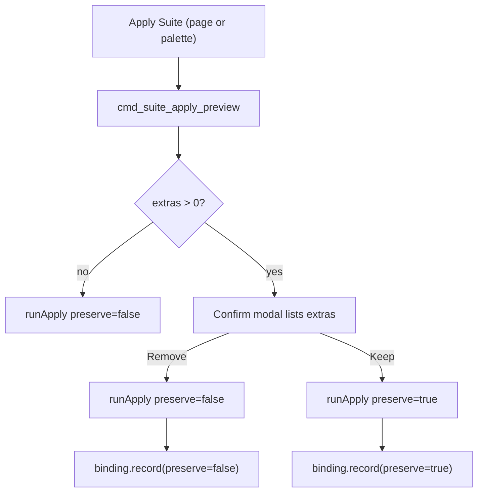

## Suite apply: preserve manually-enabled extras

### Current behaviour
`api::apply_suite` is a full reset: every scanned item not matched by the suite is forced to `desired = false`, so the planner removes links/copies and `sync_rules`/`sync_hooks` rewrite their managed blocks to exactly the suite set. Anything the user manually enabled in the Manager matrix (and not in the suite) is wiped.

```210:218:crates/agentic-core/src/api.rs
    let desired: HashMap<String, bool> = items
        .iter()
        .map(|it| (it.id.clone(), suite.capabilities.iter().any(|r| r.matches_item(it))))
        .collect();
```

### Target behaviour
On Apply, compute "extras" = items currently `Enabled` on disk for the target tool that are NOT matched by the effective suite (`merge_base_caps(selected, base)`). If extras exist, show a confirm modal listing them:
- Remove them -> current full-reset logic (`preserveUnmanaged = false`).
- Keep them -> apply suite but leave extras enabled (`preserveUnmanaged = true`).
- Cancel.

If no extras, apply directly (no modal). The choice persists on the binding so suite-edit / base-change re-syncs honour it. Preserved extras stay unmatched by the suite, so `suite_ownership` leaves their matrix cells unlocked (no change needed there).



### Rust core (TDD: failing test first per AGENTS.md)

- `crates/agentic-core/src/model.rs` (`SuiteBinding`, line 562): add `pub preserve_unmanaged: bool` with `#[serde(default)]` so existing `suite-bindings.json` still deserializes. Regenerate `SuiteBinding.ts`.
- `crates/agentic-core/src/api.rs`:
  - Add helper `enabled_item_ids(items, settings, tool) -> HashSet<String>` reusing `planner::inspect_tool` + `hook_sync::inspect_hooks` (+ `load_manifests`) and collecting ids whose `state == Enabled`.
  - Add pure fn `suite_apply_extras(items, settings, tool, effective: &SuiteDefinition) -> Vec<String>`: `enabled_item_ids` minus ids matched by `effective.capabilities`. This is the testable core for the preview command.
  - Change `apply_suite(..., preserve_unmanaged: bool)`: build `desired` as `suite_match || (preserve_unmanaged && enabled_now.contains(id))` instead of `suite_match`. `apply_suite_to_tools` threads the flag through.
  - Tests: preserve keeps an enabled non-suite item; preserve=false still wipes it (parity with existing full-reset tests); `suite_apply_extras` lists exactly enabled-not-in-suite ids.
- `crates/agentic-core/src/suite_binding_store.rs`: `record(tool, suite_id, preserve_unmanaged)` writes the flag; test round-trips it and confirms upsert-by-tool. Update existing `record` callers/tests.

### Tauri commands

- `crates/agentic-hub/src/commands.rs`:
  - `ApplySuiteInput`: add `#[serde(default)] pub preserve_unmanaged: bool`.
  - `cmd_apply_suite` (line 575): pass flag to `api::apply_suite`; `SuiteBindingStore::record(tool, suite_id, preserve_unmanaged)`.
  - `resync_bindings` (line ~503): read each binding's `preserve_unmanaged` and pass to `apply_suite` (so `cmd_update_suite` and `cmd_set_base_suite` honour the stored choice).
  - New `cmd_suite_apply_preview(input: { toolId, suiteId }) -> Vec<String>`: load suite, `backfill_sources`, `merge_base_caps` with base, return `api::suite_apply_extras(...)` (extra item ids).
- `crates/agentic-hub/src/lib.rs` (line 161): register `commands::cmd_suite_apply_preview` in `generate_handler!`. (Custom `cmd_*` commands need no capability-file entry per `capabilities/default.json`.)

### Frontend

- `src/ipc.ts`: `applySuite(toolId, suiteId, preserveUnmanaged)` includes the flag; add `suiteApplyPreview(toolId, suiteId)`.
- New `src/state/apply.ts` (shared, so page + palette both use it):
  - `pending: { tool, suiteId, suiteName, extras: string[] } | null`.
  - `request(tool, suiteId, suiteName)`: previews; sets `pending` when extras exist, else `runApply(tool, suiteId, false)`.
  - `confirm(preserve)` / `cancel()`; `runApply(tool, suiteId, preserve)` calls `applySuite` and emits the success/warning toast (logic moved out of the suites store).
- `src/components/suites/SuitesPage.tsx` (`onApply`, line 135): empty suite -> existing `AlertDialog` confirm then `runApply(preserve=false)`; otherwise `useApplyStore.request(applyTool, selectedId, name)`. Remove `applySelected` usage.
- `src/state/suites.ts`: drop `applySelected` (and its toast); CRUD-only. Update its Vitest tests.
- `src/components/palette/commands.ts` (`applyToTool`, line 391): route through `useApplyStore.getState().request(...)`; update the "Full reset" subtitle to note it now prompts when extras exist.
- New `src/components/suites/ApplySuiteConfirmDialog.tsx`: App-level `AlertDialog` driven by `apply.ts`, listing extra names (resolved from `useManagerStore` items by id) with Remove / Keep / Cancel. Render it in `App.tsx` next to `<ConflictDialog />` (line 201).

### Tests & docs

- `cargo test --workspace` + `cargo clippy --all-targets --all-features --locked -- -D warnings`.
- `pnpm test` for `state/apply.ts` and updated `state/suites.ts`; extend `palette/commands.test.ts` for the new `request` routing.
- Regenerate TS types: `cargo test -p agentic-core --features=ts-export` (for `SuiteBinding`).
- Docs sync: `docs/features/suite-presets.md`, `docs/tech/modules/suite-bindings.md`, `docs/tech/modules/tauri-ipc-contract.md` (new preview command + `preserveUnmanaged`); append one line to `RELEASE.md` and `CHANGELOG.md`.

### Assumptions
- "Extras" matched by bare id + source-aware `matches_item`, identical to apply, computed in Rust (UI shows names by resolving ids against loaded items).
- Preserved extras remain unlocked in the Manager matrix (they are not suite-owned), which is the intended "leave user's manual choices alone" semantics.