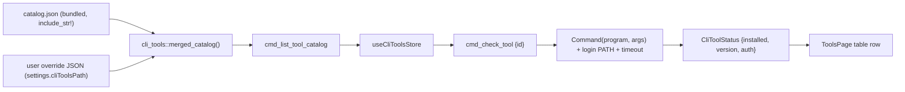

# Tools Preflight in the Resources Panel

## Goal

Turn the `Resources` tab into a two-pane view (left rail switches **Tools** / **Skills**) and add a Tools preflight table: name, status (installed / authed-if-applicable), and an Install link. Tools are defined in a bundled JSON catalog, mergeable with a user-local override; remote/hot-update is deferred. Status comes from running each tool's check command in Rust with the resolved login `PATH`.

## Data flow

## Backend (agentic-core, test-first)

- NEW [crates/agentic-core/src/cli_tools.rs](crates/agentic-core/src/cli_tools.rs):
  - Types (ts-rs exported): `CliTool { id, name, category?, installUrl, check: CliCommand, auth: Option<CliCommand> }`, `CliCommand { program, args }`, `AuthState` enum (`notApplicable | authed | notAuthed | unknown`), `CliToolStatus { id, installed, version, auth, message? }`.
  - Pure, unit-tested helpers: `parse_catalog(&str)`, `parse_version(stdout) -> Option<String>` (first non-empty line / version-ish token), `merge_catalogs(bundled, custom)` (custom overrides/append by `id`).
  - Impure `check_tool(&CliTool) -> CliToolStatus`: run `check` (installed + version); if installed and `auth` present, run it (`authed`/`notAuthed`). Each spawn uses login `PATH` and a hard timeout so a hanging/network auth check can't stall the pool.
  - `BUNDLED: &str = include_str!("../../../resources/cli-tools/catalog.json")`.
- NEW shared [crates/agentic-core/src/shell_env.rs](crates/agentic-core/src/shell_env.rs): extract `login_path()` + `command_with_login_path(program)` out of `skill_source.rs` (it currently owns `login_path`/`path_shells`/`extract_framed` around [skill_source.rs L316-380](crates/agentic-core/src/skill_source.rs)); refactor `npx_command()` to use it. Keeps the PATH-resolution logic in one place (per AGENTS.md "one place" rule) and its existing tests move with it.
- NEW [resources/cli-tools/catalog.json](resources/cli-tools/catalog.json): node, python3, homebrew (`brew`), git, gh (+`gh auth status`), glab (GitLab CLI, +`glab auth status`), claude (Claude Code), codex (+`codex login status`), cursor-agent (Cursor CLI), vercel (+`vercel whoami`). Auth declared only where a stable status subcommand exists; others omit `auth` (advisory, easy to tweak as data).
- MODIFY [crates/agentic-core/src/settings.rs](crates/agentic-core/src/settings.rs): add `#[serde(default)] cli_tools_path: Option<PathBuf>` + `resolved_cli_tools_path()` (mirrors the existing `resolved_*_path` pattern). `#[serde(default)]` keeps legacy configs loading.
- MODIFY [crates/agentic-core/src/lib.rs](crates/agentic-core/src/lib.rs): `pub mod cli_tools; pub mod shell_env;` + re-exports.

## IPC (agentic-hub)

- MODIFY [crates/agentic-hub/src/commands.rs](crates/agentic-hub/src/commands.rs): thin wrappers
  - `cmd_list_tool_catalog() -> Vec<CliTool>` (load bundled + optional user override from `resolved_cli_tools_path()`, merge).
  - `cmd_check_tool(input { id }) -> CliToolStatus` via `spawn_blocking` (like `cmd_search_skills` at [commands.rs L731](crates/agentic-hub/src/commands.rs)).
- MODIFY [crates/agentic-hub/src/lib.rs](crates/agentic-hub/src/lib.rs): register both in `invoke_handler`. (Custom `cmd_*` are window-local; `capabilities/default.json` enumerates only plugin perms, so no capability edit needed.)
- Regenerate TS types: `cargo test -p agentic-core --features=ts-export` (emits `CliTool.ts`, `CliCommand.ts`, `AuthState.ts`, `CliToolStatus.ts`, updates `Settings.ts`).

## Frontend

- MODIFY [src/ipc.ts](src/ipc.ts): `listToolCatalog()`, `checkTool(id)`.
- NEW [src/state/cliTools.ts](src/state/cliTools.ts) + tests: `useCliToolsStore` with `catalog`, `statusById`, `checking` set; `loadCatalog()`, `checkOne(id)`, `checkAll()` (parallel `Promise.all`, rows update as each resolves). Auto-run `loadCatalog` then `checkAll` on first open.
- NEW [src/components/resources/ResourcesPage.tsx](src/components/resources/ResourcesPage.tsx) + `ResourcesRail.tsx`: a sticky left rail (reusing `ScopeRail`'s look at [ScopeRail.tsx L46-83](src/components/workspace/ScopeRail.tsx)) with **Tools** (always) and **Skills** (only when skills.sh enabled). Internal `pane` state, default `tools`. Renders `ToolsPage` or the existing `SkillsPage`.
- NEW [src/components/resources/ToolsPage.tsx](src/components/resources/ToolsPage.tsx): `Table` with columns **Tool** (name + mono id), **Status** (badges: Installed/Not installed + version; Authed/Needs auth when applicable; spinner while checking), **Action** (per-row Refresh icon; Install `ExternalLink` → `openUrl(installUrl)` when not installed). Plus a "Refresh all" header button. Reuse `openExternal` pattern from [SkillsPage.tsx L29-34](src/components/skills/SkillsPage.tsx).
- MODIFY [src/components/layout/Header.tsx](src/components/layout/Header.tsx): show the `Resources` tab unconditionally (drop the `skillsEnabled &&` gate at [Header.tsx L28](src/components/layout/Header.tsx)).
- MODIFY [src/App.tsx](src/App.tsx): route `skills` renders `<ResourcesPage />` (hash id stays `skills` for deep-link/palette stability; label remains "Resources").

## Tests & verification

- Rust: unit tests in `cli_tools.rs` (parse, version extraction, merge/override, auth-state mapping); moved PATH tests stay green. `cargo test --workspace` + `cargo clippy --all-targets --all-features --locked -- -D warnings`.
- UI: `cliTools.test.ts` (catalog load, checkAll populates statuses, override append/replace, error path) mocking `@/ipc`. `pnpm test`.
- Manual: open Resources → Tools auto-checks; toggle a tool off PATH to see Not installed + Install link; `gh`/`vercel` show auth state.

## Docs & security note

- NEW `docs/tech/modules/cli-tools.md`; link from [docs/README.md](docs/README.md); `CHANGELOG.md` `[Unreleased]`.
- Security: checks run `Command::new(program).args(args)` with **no shell** (no `sh -c`), so no metacharacter injection. The bundled catalog is trusted; the user-local override executes user-supplied program+args on the user's own machine (analogous to existing custom source paths) — documented as a trust boundary, with per-check timeouts. No `tauri-plugin-shell`.