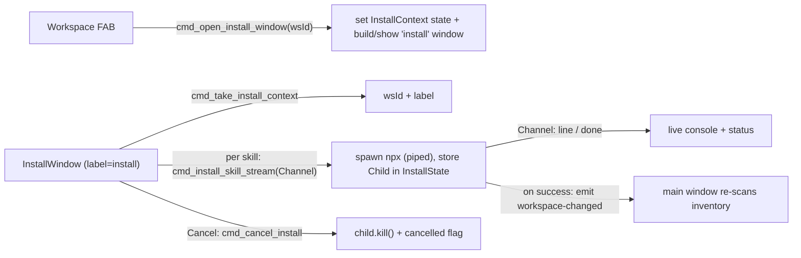

# Unified Scope View + Streaming Install Window

Three enhancements on the existing branch `feat/workspace-install-ux-20260604` (PR #17). Because this adds a new window, new IPC, and process streaming, it grows past a patch — I'll **fold the unreleased `0.6.1` notes into `0.7.0`** (0.6.1 was never merged/released).

## Part 1 — Fuse Global + Workspace into one left-rail view

Today the scope is a `Select` in [src/components/layout/Header.tsx](src/components/layout/Header.tsx); [src/App.tsx](src/App.tsx) branches the Manager route on `scope` (global -> `Matrix`/`EmptyState`, workspace -> `WorkspaceView`). We unify it: the Manager route always renders a left rail + content pane, with **Global pinned at the top of the rail like a workspace entry**.

- Remove the scope `Select` from `Header.tsx`.
- Rename [src/components/workspace/WorkspaceRail.tsx](src/components/workspace/WorkspaceRail.tsx) -> `ScopeRail.tsx`: a pinned **Global** row (globe icon, active when `scope === "global"`) above the remembered workspaces (active when `scope === "workspace" && activeId === t.id`). Keep the add-workspace and remove buttons; keep the sticky + inner-scroll behavior.
  - Global click: `setScope("global")` (App's existing effect re-runs `refresh()`), then reset scoped filters (Part 2).
  - Workspace click: `setScope("workspace")` + `useWorkspaceStore.activate(id)`, then reset scoped filters.
- Replace [src/components/workspace/WorkspaceView.tsx](src/components/workspace/WorkspaceView.tsx) with `src/components/manager/ManagerView.tsx`: renders `<ScopeRail/>` + a content pane. Content = global: `EmptyState`/`Matrix`; workspace: loading/select `Alert` or read-only `Matrix`. The install FAB renders only when `scope === "workspace" && activeId && skillsEnabled`. Moves the `scanErrors` details (currently in App) into the pane.
- `App.tsx`: Manager route renders `<ManagerView/>` for both scopes. Keep the `scope === "global"` refresh effect; on mount, also `reload()` workspace targets so the rail is populated while staying in global scope by default.

## Part 2 — Reset scope-specific filters on switch

[src/state/managerFilters.ts](src/state/managerFilters.ts) holds `source`, `enabledOnly`, `collapsed`, `locateId`, plus the universal `query`/`kind`/`view`. The bug: a `source` id selected in one scope often doesn't exist in the other (workspace adds a `Workspace` source and drops un-projected shared roots), so the matrix filters to empty; `enabledOnly` is hidden in workspace but persists back.

- Add `resetScopedFilters()` to the filters store: clear `source`, `enabledOnly`, `collapsed`, `locateId`; **keep** `query`, `kind`, `view`.
- Call it from `ScopeRail` whenever the scope kind actually changes (global <-> workspace).
- Extend [src/state/managerFilters.test.ts](src/state/managerFilters.test.ts) with a reset test.

## Part 3 — Dedicated, live-streaming install window with Cancel

Mirror the `palette` window pattern. The FAB opens a real window (`install` label) that loads the starred-skill `skill x tool` matrix, runs `npx skills add` per selected skill while **streaming stdout/stderr live** into an auto-scrolling console, and exposes a **Cancel** button that kills the running process.

### Backend (Rust)
- [crates/agentic-core/src/skill_source.rs](crates/agentic-core/src/skill_source.rs): add a pure `skills_install_command(install_ref) -> Command` (reuses `npx_command` + `skills_npx_args`; PATH/validation already tested) so the shell layer only does IO. Add a ts-rs-exported `SkillInstallEvent` enum (`{ kind: "line", stream, text }` / `{ kind: "done", ok, cancelled }`).
- New `crates/agentic-hub/src/install_window.rs`:
  - `InstallContextState(Mutex<Option<InstallContext>>)` and `InstallState(Mutex<Option<Child>>)`.
  - `cmd_open_install_window(app, workspace_id)`: store context, build/show a decorated resizable `install` window (`WebviewUrl::App("index.html")`, ~760x620). Built fresh per open; closes normally (only `main`/`palette` are special-cased in `on_window_event`).
  - `cmd_take_install_context(state) -> InstallContext` (wsId + label) — called by the window on mount.
  - `cmd_install_skill_stream(app, state, input, on_event: Channel<SkillInstallEvent>)`: validate ref, resolve workspace dir from `WorkspaceTargetStore` (same as today), spawn `skills_install_command` with piped stdout/stderr, store the `Child` in `InstallState`, stream lines over the channel, send `done`; on success nudge watcher + `emit("workspace-changed")`.
  - `cmd_cancel_install(state)`: kill the stored child.
- [crates/agentic-hub/src/lib.rs](crates/agentic-hub/src/lib.rs): `.manage()` the two states; register the four new commands; remove the now-unused blocking `cmd_install_skill`.
- New [crates/agentic-hub/capabilities/install.json](crates/agentic-hub/capabilities/install.json): `windows: ["install"]`, `core:default` + window show/hide/close/set-focus/start-dragging (custom `cmd_*` are cross-window, no plugin perm needed).

### Frontend
- [src/main.tsx](src/main.tsx): `label === "install"` -> render `<InstallWindow/>`.
- New `src/components/install/InstallWindow.tsx`: on mount `cmd_take_install_context` + load favorites; render the `skill x tool` matrix (extracted from the current `InstallSkillDialog` into `InstallMatrix.tsx`), an Install/Cancel control, and a live `<pre>` console (auto-scroll). Drives `installSkillStream` per selected skill via a `Channel`, appends lines, tracks per-skill + overall status; Cancel calls `cancelInstall` and stops the batch.
- The FAB in `ManagerView` calls `cmd_open_install_window(activeId)` instead of opening the dialog.
- Remove [src/components/workspace/InstallSkillDialog.tsx](src/components/workspace/InstallSkillDialog.tsx); trim [src/state/skills.ts](src/state/skills.ts) (`installMany`/`installLog`/`clearInstallLog` become window-local) and update [src/state/skills.test.ts](src/state/skills.test.ts).
- [src/ipc.ts](src/ipc.ts): add `openInstallWindow`, `takeInstallContext`, `installSkillStream(input, channel)` (via `Channel` from `@tauri-apps/api/core`), `cancelInstall`. Regenerate types (`pnpm gen:types`) for `SkillInstallEvent` / `InstallContext`.

## Docs + version
- Version -> `0.7.0`: [package.json](package.json), [crates/agentic-hub/tauri.conf.json](crates/agentic-hub/tauri.conf.json), both `Cargo.toml`, `Cargo.lock`.
- Update [docs/features/skills-sh-integration.md](docs/features/skills-sh-integration.md), [docs/tech/modules/skill-sources.md](docs/tech/modules/skill-sources.md), [docs/tech/modules/tauri-ipc-contract.md](docs/tech/modules/tauri-ipc-contract.md) (new commands + `install` window + capability), [ARCHITECTURE.permissions.md](ARCHITECTURE.permissions.md) (new capability file), and the workspace-inventory feature doc (unified rail). Fold the unreleased `0.6.1` section of `CHANGELOG.md`/`RELEASE.md` into `0.7.0`.

## Testing (ask before running)
- Vitest: `managerFilters` reset; trimmed `skills` store.
- Rust: `skills_install_command` builds the expected `npx` arg vector; `validate_install_ref` unchanged; `cargo clippy`.
- Manual: rail Global/workspace switching + filter reset; FAB opens the window; live streaming output; Cancel kills the process; main window re-scans after success.

## Notable decisions / risks
- Selection + console both live in the install window (cohesive "Install" surface); the modal dialog is retired.
- Cancel relies on a single in-flight child (installs run sequentially), stored in `InstallState`.
- Still no `tauri-plugin-shell`; the login shell only reads `PATH`, install spawns a fixed arg vector via `std::process::Command`.