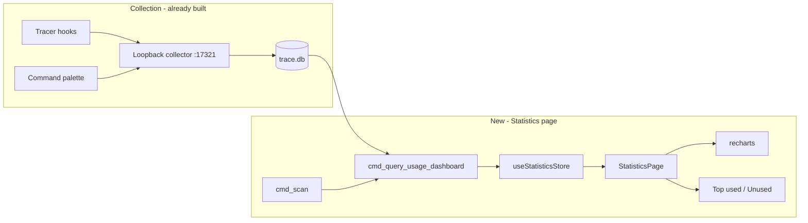

# Usage Statistics Dashboard

## Context

Your running app already collects usage data into [`~/.agentic-hub/usage/trace.db`](~/.agentic-hub/usage/trace.db) via managed tracer hooks. The schema and collector live on **unmerged commits** (`23c03f7` → `336c523`), not on `main`. Current `main` has no `usage_store`, no `Usage` matrix column, and no Statistics route.

**Existing data (68 events in your DB):**

| Dimension | Values |
|-----------|--------|
| Event types | `PostSkillUse` (42), `PostToolUse` (20), `CommandPaletteUse` (6) |
| Source tools | `cursor` (58), `agentic-hub` (6), `codex` (4) |
| Kinds | skill (45), command (6), unresolved (17) |
| Time range | 2026-07-07 → 2026-07-09 |

**Existing APIs on tracing branch** (to rebase first):

- `cmd_query_usage_stats` → per-capability `UsageStats` (execution count, per-tool buckets, last used)
- `cmd_usage_tracing_status` → collector health, resolved/unresolved counts
- Matrix `Usage` column with hover tooltip ([`Matrix.tsx` on `336c523`](src/components/manager/Matrix.tsx))

The feature doc already scoped V1.1 as *"Date filters and detail drilldown"* — this Statistics page is that slice.



---

## Phase 0 — Rebase tracing onto main (prerequisite)

Branch: `feat/usage-statistics-dashboard-20260709`

Cherry-pick or rebase the three tracing commits onto current `main` (`b9a8a3f`):

1. `23c03f7` — core store, collector, config toggle, matrix column
2. `6257e45` — command palette usage recording
3. `336c523` — agent capability attribution

Resolve any conflicts with post-tracing `main` changes. Verify:

- `cargo test --workspace` green
- `pnpm test` green (manager/palette store tests from tracing branch)
- Tracing toggle in Config still works; collector writes to `trace.db`

Key files restored:

- [`crates/agentic-core/src/usage_store.rs`](crates/agentic-core/src/usage_store.rs)
- [`crates/agentic-hub/src/usage_collector.rs`](crates/agentic-hub/src/usage_collector.rs)
- [`docs/features/local-skill-usage-tracing.md`](docs/features/local-skill-usage-tracing.md)
- [`docs/tech/modules/local-usage-tracing.md`](docs/tech/modules/local-usage-tracing.md)

---

## Phase 1 — Dashboard aggregation API (Rust)

Extend `usage_store` with a new query method and ts-rs types. Keep all SQL in `agentic-core`; the Tauri command is marshalling-only.

### New types (`agentic-core/src/model.rs`)

```rust
UsageDashboard {
  overview: UsageDashboardOverview,      // totals + health
  by_kind: Vec<UsageKindBucket>,         // skill / command / agent
  by_source_tool: Vec<UsageSourceBucket>,// cursor, codex, agentic-hub
  by_day: Vec<UsageDayBucket>,           // time series
  top_capabilities: Vec<UsageTopRow>,    // top N by count
  unused_capabilities: Vec<UsageUnusedRow>,// installed, 0 usage
  by_workspace: Vec<UsageWorkspaceBucket>,
}
```

`UsageTopRow` / `UsageUnusedRow` join scan metadata:

- `capabilityId`, `name`, `kind`, `sourceLabel`, `relativePath` (from `CapabilityItem`)
- `executionCount`, `lastUsedAt`, `toolBuckets`

### New query (`usage_store.rs`)

`query_dashboard(items: &[CapabilityItem], range: UsageDateRange) -> UsageDashboard`

| Query | SQL dimension |
|-------|---------------|
| Overview | `COUNT(*)`, resolved/unresolved, distinct `capability_id`, date-filtered |
| By kind | `GROUP BY` kind prefix of `capability_id` (`skill:`, `command:`, `agent:`) |
| By source tool | `GROUP BY source_tool` |
| By day | `GROUP BY date(timestamp)` |
| Top N | `GROUP BY capability_id ORDER BY count DESC LIMIT 15` |
| Unused | scan items minus ids with `execution_count > 0` |
| By workspace | `GROUP BY workspace` where not null |

**Date range filter** (default: last 30 days; options: 7d / 30d / 90d / all):

```rust
pub enum UsageDateRange { Last7Days, Last30Days, Last90Days, AllTime }
```

Reuse existing `terminal_sql_filter()` so `PostToolUse` raw events don't inflate skill counts (same rule as `query_stats`).

### New IPC

| Command | Args | Returns |
|---------|------|---------|
| `cmd_query_usage_dashboard` | `items: Vec<CapabilityItem>`, `range: UsageDateRange` | `UsageDashboard` |

Wire in [`crates/agentic-hub/src/commands.rs`](crates/agentic-hub/src/commands.rs), register in [`src-tauri/capabilities/default.json`](src-tauri/capabilities/default.json), export types via `ts-rs`, add to [`src/ipc.ts`](src/ipc.ts).

**Tests (TDD, Rust):** unit tests in `usage_store.rs` for each aggregation bucket, date filtering, unused detection, and terminal-event exclusion.

---

## Phase 2 — Statistics page (React)

### Routing

Extend [`src/shared.tsx`](src/shared.tsx):

```ts
export type Route = "manager" | "suites" | "skills" | "statistics" | "config";
```

Update [`src/App.tsx`](src/App.tsx) (`ROUTES`, render) and [`src/components/layout/Header.tsx`](src/components/layout/Header.tsx) — add **Statistics** tab immediately before Config:

```tsx
<TabsTrigger value="statistics">Statistics</TabsTrigger>
<TabsTrigger value="config">Config</TabsTrigger>
```

### Store

New [`src/state/statistics.ts`](src/state/statistics.ts):

- `reload(range)` → `scan()` + `queryUsageDashboard(items, range)`
- State: `dashboard`, `range`, `loading`, `error`, `tracingStatus`
- Gate: if tracing disabled, show empty state pointing to Config toggle (reuse `usageTracingStatus`)

Vitest: mock `@/ipc`, test range changes, empty/disabled states, overview number mapping.

### Page layout

New [`src/components/statistics/StatisticsPage.tsx`](src/components/statistics/StatisticsPage.tsx) — Config-style stacked `Card` panels per [`DESIGN.md`](DESIGN.md):

```
StatisticsPage
├── ToolbarCard
│   ├── Date range Select (7d / 30d / 90d / All)
│   └── Refresh button
├── OverviewCard (4 stat tiles)
│   ├── Total events (in range)
│   ├── Traced capabilities (used at least once)
│   ├── Unused installed (skill/command/agent with 0 usage)
│   └── Collector status (running / stored / unresolved)
├── ActivityOverTimeCard
│   └── recharts BarChart — daily event volume
├── UsageByDimensionCard (2-column grid)
│   ├── BarChart — by kind (skill / command / agent)
│   └── BarChart — by source tool (Cursor / Codex / Palette)
├── TopUsedCard
│   └── Table — name, kind badge, source, count, last used, per-tool breakdown
└── UnusedInstalledCard
    └── Table — pruning candidates: name, kind, source, relative path
```

### Chart library — recharts (confirmed)

**Decision:** use [recharts](https://recharts.org/) for all charts. No table-only fallback.

**Install (first step of Phase 2):**

```bash
pnpm add recharts
```

**Wrapper components** — thin themed shells in `src/components/statistics/charts/` so chart config stays out of the page:

| File | recharts primitives | Data source |
|------|---------------------|-------------|
| `ActivityChart.tsx` | `ResponsiveContainer` + `BarChart` + `Bar` + `XAxis` + `YAxis` + `Tooltip` | `dashboard.byDay` |
| `KindBreakdownChart.tsx` | `BarChart` (horizontal) + `Bar` | `dashboard.byKind` |
| `SourceToolChart.tsx` | `BarChart` (horizontal) + `Bar` | `dashboard.bySourceTool` |
| `chartTheme.ts` | shared color map + axis/tooltip styles | — |

**Theming** (read from CSS tokens / `DESIGN.md` constants, not ad-hoc hues):

- Primary bars: `#4f46e5` (indigo)
- Kind bars: skill=`#4f46e5`, command=`#f59e0b`, agent=`#a855f7`
- Axis labels / grid: `#9aa0ad` / `#272a33`
- Tooltip: `bg-popover` surface, `tabular-nums` counts
- Chart height: fixed `h-[220px]` inside each card; `ResponsiveContainer width="100%" height="100%"`

**Imports:** use named imports only (`import { BarChart, Bar, ... } from "recharts"`) — no default import. Lazy-load chart cards via `React.lazy` if bundle audit shows impact.

No shadows on static cards; charts live inside `Card className="p-4"`.

### Empty / disabled states

| State | UX |
|-------|-----|
| Tracing off | Alert card: "Enable local usage tracing in Config" + link hash `#/config` |
| Tracing on, 0 events | Overview shows zeros; charts show "No data yet" |
| High unresolved % | Warning badge in Overview (reuse Config diagnostic semantics) |

---

## Phase 3 — Docs sync

Update existing docs (no new summary files):

- [`docs/features/local-skill-usage-tracing.md`](docs/features/local-skill-usage-tracing.md) — move V1.1 slice to shipped; add Statistics page acceptance criteria
- [`docs/tech/modules/local-usage-tracing.md`](docs/tech/modules/local-usage-tracing.md) — document `cmd_query_usage_dashboard`, `UsageDashboard` types, date range
- [`docs/tech/modules/tauri-ipc-contract.md`](docs/tech/modules/tauri-ipc-contract.md) — register new command
- [`CHANGELOG.md`](CHANGELOG.md) — unreleased entry
- [`RELEASE.md`](RELEASE.md) — one sentence when cutting release

---

## Test plan (for approval before running)

| Suite | What |
|-------|------|
| `cargo test -p agentic-core usage_store` | New dashboard aggregation tests |
| `cargo test --workspace` | Full regression after rebase |
| `pnpm test src/state/statistics.test.ts` | Store logic |
| `pnpm test` | Existing store tests still green |
| Manual | Enable tracing → use a skill → Statistics shows count; change date range; unused table lists zero-usage skills |

---

## Risks

| Risk | Mitigation |
|------|------------|
| Rebase conflicts with `main` drift | Resolve in Phase 0 before any new code |
| Sparse data (68 events, 3 days) | Charts handle 0–1 point gracefully; default 30d range |
| `Matrix.tsx` already large (~700 lines) | Statistics is a separate page; no further Matrix growth |
| recharts bundle size | Single lazy import per chart card if needed |

---

## Out of scope (this slice)

- Editing/deleting usage events from UI
- Remote Aptabase analytics dashboard
- Rule/hook usage counts
- Export to CSV/OTel (V2 in feature doc)
