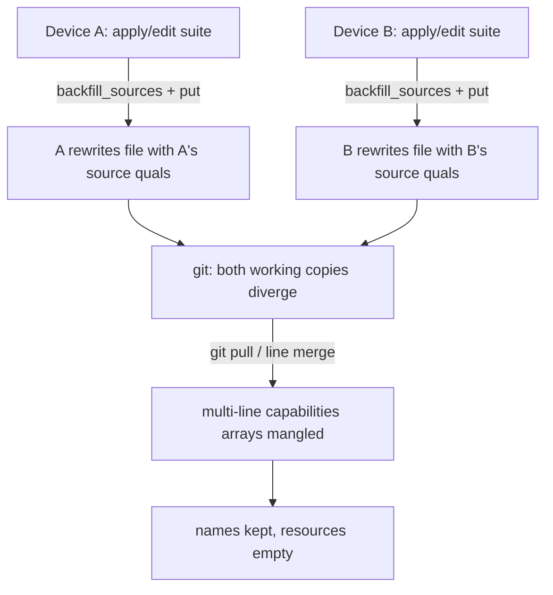

# v0.8.1 — Watcher default, suite git-sync fix, favorites parity

## Issue 2 — Root cause (the important one)

The symptom (confirmed): suite **names persist but their capabilities go empty**, the app is **running during `git pull`**, and the suites file is at a **custom path inside a git repo**. `git checkout`/revert restores it.

I traced every write path:
- `crates/agentic-core/src/suite_store.rs` `create`/`update`/`put`/`set_base` can never turn N suites into 0 capabilities (they error rather than empty; `backfill_sources` only *adds* source qualifiers, never drops caps).
- The frontend `save` in `src/state/suites.ts` rebuilds capabilities from the full `draft.capabilities`, so it also can't empty a populated suite.

So no single function emits empty capabilities. The corruption comes from **the app rewriting the synced file behind the user's back**:

On every `cmd_apply_suite` and `cmd_update_suite` (including the palette "Apply suite…"), the app runs `SuiteStore::backfill_sources` and, if it changed anything, calls `store.put(&suite)` — re-serializing the whole multi-line file with **device-specific `source` qualifications**:

```583:585:crates/agentic-hub/src/commands.rs
    if SuiteStore::backfill_sources(&mut suite, &scanned.items) {
        let _ = store.put(&suite);
    }
```

Because the file lives in a git repo synced across two machines, each device independently rewrites it at different times → both working copies diverge. On `git pull`, git does a **line-based 3-way merge of the divergent multi-line `capabilities: [...]` blocks**; the merge mangles those arrays — emptying capabilities while the suite name/braces (separate lines) survive. Reverting git restores the committed copy.

Secondary contributor: the running app never reloads suites on an external file change (it only reacts to its own `suite-store-changed` emits), so its in-memory view goes stale after a pull and a later save can clobber freshly-pulled content.



### Fix
1. **Stop the silent rewrites (the actual cause).** Drop the opportunistic `store.put(&suite)` after `backfill_sources` in both `cmd_apply_suite` and `cmd_update_suite` in [crates/agentic-hub/src/commands.rs](crates/agentic-hub/src/commands.rs) (keep the in-memory backfill for the apply computation only). Bare/portable refs are already qualified by the frontend at user-save time (`src/state/suites.ts` `save`), so apply/palette actions become pure reads and the synced file stops churning. Prove-it test: applying a suite leaves the suites file byte-identical.
2. **Backup before write (defense-in-depth).** In `SuiteStore::write_file` ([crates/agentic-core/src/suite_store.rs](crates/agentic-core/src/suite_store.rs)) copy the current good file to `<file>.bak` before the atomic `tmp`+`rename`, so any accidental clobber is recoverable without git.
3. **Keep the running view fresh.** Watch the resolved suites file in [crates/agentic-hub/src/watcher.rs](crates/agentic-hub/src/watcher.rs) and emit `suite-store-changed` on external change so the Suites page (already listening via `onSuiteStoreChanged`) reloads after a `git pull`, closing the stale-snapshot window. Reconcile on a suites-only change is idempotent/harmless.

## Issue 1 — Watcher on by default + toggle in Config

`watcher_enabled` already defaults to `true` and starts on launch ([crates/agentic-hub/src/lib.rs](crates/agentic-hub/src/lib.rs) line 67), so the work is the forced-on migration + UX move:
- **Force-on once (chosen).** Add a `#[serde(default)] watcher_force_migrated: bool` to `Settings` ([crates/agentic-core/src/settings.rs](crates/agentic-core/src/settings.rs)); in `setup()` ([crates/agentic-hub/src/lib.rs](crates/agentic-hub/src/lib.rs)), if not migrated, set `watcher_enabled = true`, mark migrated, save — flips existing paused configs on once, without re-overriding future pauses.
- **Move the toggle to Config.** Add an enable/pause `Switch` to the `WatcherPanel` in [src/components/config/ConfigPage.tsx](src/components/config/ConfigPage.tsx), wired to the existing `watching` / `toggleWatching` in `src/state/manager.ts`. Remove the `Toggle` block from [src/components/layout/Header.tsx](src/components/layout/Header.tsx). The palette Pause/Resume action and `hub-watcher-changed` sync stay as-is.

## Issue 3 — Favorites parity with the suites file

The favorites path is already configurable (`SkillsConfig.favoritesPath`, `resolved_favorites_path()`, Config "Starred-skills file" panel) and commands already honor it. Bring it to suites-level robustness:
- **Backup before write** in `SkillFavoritesStore::write` ([crates/agentic-core/src/skill_favorites.rs](crates/agentic-core/src/skill_favorites.rs)), same `.bak` pattern.
- **Watch + reload**: watch the resolved favorites file in the watcher; emit a new `skills-favorites-changed` event; add `onSkillsFavoritesChanged` to [src/ipc.ts](src/ipc.ts) and reload in [src/components/skills/SkillsPage.tsx](src/components/skills/SkillsPage.tsx) so a `git pull` refreshes the starred list live.

## Tests, docs, release
- TDD for core: suite-store backup test, favorites backup test, "apply does not rewrite the suites file" test; keep `cargo test --workspace` + Vitest green.
- Docs: update `docs/tech/modules/watcher.md`, `docs/features/source-watcher.md` (suites/favorites file watching; toggle in Config), `docs/tech/modules/suite-presets.md` (no auto-rewrite + backup), `docs/tech/modules/skill-sources.md` (favorites backup + watch).
- Version bump to `0.8.1` across `package.json`, `crates/*/Cargo.toml`, `src-tauri/tauri.conf.json`; replace `RELEASE.md` with 0.8.1 notes; prepend `CHANGELOG.md`.
- Branch `feat/v0.8.1-watcher-suite-sync-20260612`; open MR to `main` (per workspace git rules — never on `main`).