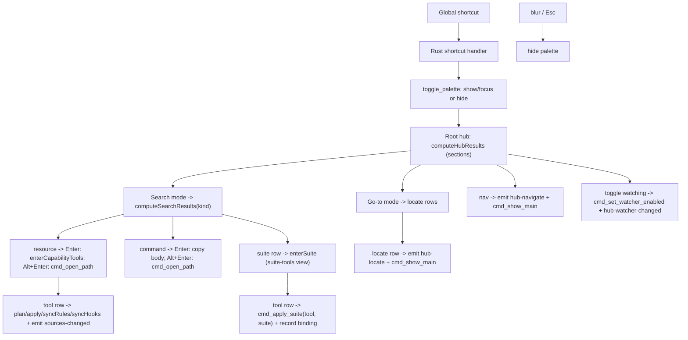

# Feature: Command Palette (Alfred-style)

Status: Implemented
Mode: Detailed
Owner: Arno
Last Updated: 2026-06-26
Depends On: [PRODUCT.md](../../PRODUCT.md), [ARCHITECTURE.md](../../ARCHITECTURE.md), [ARCHITECTURE.permissions.md](../../ARCHITECTURE.permissions.md)
Related Docs: [docs/tech/modules/tauri-ipc-contract.md](../tech/modules/tauri-ipc-contract.md), [docs/features/open-files.md](./open-files.md), [docs/tech/modules/suite-bindings.md](../tech/modules/suite-bindings.md)

## Why now

The manager and suites views are great once the app is open and focused, but the
fastest path to a capability is a global summon — type a few letters, hit Enter,
edit the file. This adds an Alfred-style floating command palette that works from
anywhere, plus the native macOS menu surface the app was missing.

## User story

As a user, I want to summon a panel from any app with a global shortcut and land
on a layered hub of first-class commands — pick a search mode (skills, agents,
rules, commands, suites, or everything), a go-to mode (locate in global or
workspace scope), a navigation target, or an action — so I search exactly the
slice of resources I mean instead of getting one global mixed result list.

## Scope

### In scope

- A dedicated floating palette window (label `palette`): borderless, transparent,
  centered, hidden until summoned, dismissed on blur or Esc. On macOS it is a
  non-activating `NSPanel` so it floats over other apps' full-screen Spaces.
- A configurable global accelerator (default `Cmd+Alt+A`) that toggles it.
- **Layered root hub.** Summoning lands on a categorized list of first-class
  commands grouped into sections — no resource results at the root:

  | Section | Rows | Behavior |
  |---------|------|----------|
  | Search | Search all resources · skills · agents · rules · hooks · commands · suites | Drill into a single-kind search view |
  | Go to | Go to global · Go to workspace | Drill into a locate view (surfaces a matrix row, never opens a file) |
  | Navigate | Open Manager · Open Suites · Open Config | Route the main window and surface it |
  | Actions | Apply suite… · Pause/Resume watching | Apply drills into suite search; watching toggles immediately |

  Typing at the root filters **hub rows only** (strict mode-only — no resource,
  workspace, or suite results until a mode is entered). Global search across
  every resource happens only through the explicit "Search all resources" mode.
- **Search modes** (one drill-in view per kind, breadcrumb `‹ Search skills`,
  Backspace on an empty query steps back):
  - `all` / `skill` / `agent` / `rule` / `hook` — match by name, relative path,
    or source; **Enter drills into the capability-tools view** (toggle the
    resource on/off per tool, inline — below); **Alt+Enter (or Alt+Click) opens
    the original file** in the configured editor — reusing the same opener path
    as the manager row menu.
  - `command` — slash-command prompts. **Enter copies the command body to the
    clipboard** (for standalone paste into any tool). When **Paste into focused
    app** is enabled in Config (macOS only), Enter also posts Cmd+V to the
    frontmost app after the palette hides — Alfred-style direct paste, gated on
    Accessibility permission. **Alt+Enter opens the source file** for editing.
    The body is read through `cmd_read_capability_body` (allowlist-gated, same
    as the opener) and written via the clipboard-manager plugin; paste uses
    `cmd_paste_to_frontmost`. See [commands.md](./commands.md).
  - `suite` — match suites by name/description; Enter drills into the existing
    suite-tools view (below).
- **Go-to modes** (locate, never open):
  - `workspace` — match inventory items across every remembered workspace (see
    [workspace-inventory.md](./workspace-inventory.md)); Enter *locates* the
    item — Manager + Workspace scope, activates the owning workspace, and
    scrolls/highlights that row in the matrix.
  - `global` — match global (shared-source) resources; Enter locates the item in
    Manager + Global scope and highlights its matrix row.
- **Toggle watching** action: flips `settings.watcherEnabled` through
  `cmd_set_watcher_enabled` and emits `hub-watcher-changed` so the main window's
  header toggle stays in sync without surfacing it.
- A two-level suite-apply flow: search a suite by name, drill into it, then
  pick one tool to apply the suite to as a full reset (clean + replace every
  resource for that tool). The applied tool is bound to the suite so a later
  capability edit re-syncs it (see [suite-bindings.md](../tech/modules/suite-bindings.md)).
- **Capability-tools view** (inline per-tool toggle): drilling into a skill /
  agent / rule / hook from a search mode opens a sub-panel that lists the user's
  enabled tools, each showing on/off state. Toggling a tool row applies the
  change **immediately** through the same `plan → apply → syncRules → syncHooks`
  pipeline the manager uses — no Manager round-trip, no Apply button — and the
  palette stays open so several tools can be flipped in a row. The panel also
  offers an **Enable/Disable for all tools** aggregate row plus **Open in editor**
  and **Reveal in Finder** action rows. Suite-managed cells render **locked** and
  do not toggle. Each toggle builds the *complete* desired map from the inspected
  state of every item — so `syncRules`/`syncHooks` (which rewrite the whole
  managed block) never drop the other enabled rules/hooks — then emits
  `sources-changed` so the main window's matrix refreshes.
- Native top menus: App (About, Settings `Cmd+,`, Hide, Quit), Edit, View
  (Command Palette), Window. `Cmd+,` routes the main window to Config.
- A Config panel to edit the shortcut (validated, re-registered on save).

### Out of scope (registry extension points)

- Install-a-skill-from-vendor — left as a provider stub for later.
- Multi-tool apply in one step — the suite-tools view applies to one tool per
  Enter (the binding still re-syncs every bound tool on a capability edit).
- Fuzzy ranking / recency — substring matching, per the v1 contract.
- Root prefix directives (e.g. `> skills`).
- Per-window themes — the palette reuses the app's dark tokens.

## How it works

- **Panel + shortcut (Rust).** `palette.rs` creates the hidden window at launch
  and owns `setup_palette` / `toggle_palette` / `hide_palette` /
  `register_palette_shortcut`. On macOS `setup_palette` subclasses the window to a
  non-activating `NSPanel` (via `tauri-nspanel`) with `FullScreenAuxiliary |
  CanJoinAllSpaces` collection behavior so it overlays full-screen apps without
  switching Spaces — standard `NSWindow` cannot ([tauri#11488](https://github.com/tauri-apps/tauri/issues/11488)).
  Panel objc ops run on the main thread (`run_on_main_thread`); non-macOS falls
  back to an always-on-top, all-workspaces window. The
  `tauri-plugin-global-shortcut` handler toggles the palette on key press; it
  hides on `WindowEvent::Focused(false)`. `macOSPrivateApi` is enabled so the
  window can be transparent.
- **Menu (Rust).** `menu.rs` builds the app menu and routes events: Settings ->
  show main + emit `menu-open-config`; Command Palette -> `toggle_palette`.
  `PredefinedMenuItem::quit` preserves Cmd+Q as the hard exit that bypasses the
  close-to-hide handler.
- **Settings.** `Settings.paletteShortcut` (default `Cmd+Alt+A`) persists in
  `~/.agentic-hub/config.json`. `cmd_save_settings` validates it via
  `is_valid_shortcut` and re-registers the accelerator; a bad saved value at
  launch falls back to the default so summon never breaks.
- **UI.** One bundle, two windows: `main.tsx` renders `<CommandPalette/>` when the
  window label is `palette`, else `<App/>`. `usePaletteStore` loads settings +
  scans + lists suites + scans every remembered workspace inventory on summon
  (`Promise.allSettled`, so one unreadable project never breaks summon), holds the
  query/selection and a `view` (`root`, `search` with a mode, `suite-tools`, or
  `capability-tools`), and derives results from the registry in
  `components/palette/commands.ts`: `computeHubResults` (root sections),
  `computeSearchResults` (one mode), `computeSuiteToolResults`, and
  `computeCapabilityToolResults` (per-tool toggle rows). On summon the store also
  fires a background `inspect` + `suiteOwnership` to populate the per-tool state
  the capability-tools view reads; toggle actions `await` that inspect before
  building the desired map. Hub rows carry a `section` label rendered as muted
  group headers; search-mode rows also show `⌃1`…`⌃7` shortcut hints and accept
  Ctrl+1…Ctrl+7 from any palette view to jump between modes. Drill-in rows set
  `dismissOnRun: false` and call `enterMode` /
  `enterSuite`; every non-root view shows a `‹ <view name>` breadcrumb and
  Backspace-on-empty steps back (suite-tools entered from suite search returns
  to that search). Navigation commands emit `hub-navigate`; the main window
  listens and switches route. Each suite-tools row runs
  `applySuite(tool, suiteId)` and dismisses.
- **Locate (workspace + global).** A locate row emits `hub-locate` — either
  `{ scope: "workspace", workspaceId, itemId }` or `{ scope: "global", itemId }` —
  then `cmd_show_main`. The main window's `App` listener routes to Manager, sets
  the matching scope (activating the owning workspace and namespacing the row id
  with `ws::` for workspace locates), and sets a transient `locateId` in the
  matrix-filters store. The `Matrix` expands the row's ancestor folders, scrolls
  it into view, highlights it for ~2s, then clears the flag.
- **Watching toggle.** The hub action calls `cmd_set_watcher_enabled` with the
  flipped value and emits `hub-watcher-changed` (payload: the new boolean); the
  main window's manager store updates its `watching` flag without re-fetching.

## Security

- The WebView holds no FS or opener scope. Resource opens go through the existing
  `cmd_open_path`, gated by `agentic_core::open_targets::is_openable`. Reading a
  command body for the clipboard uses `cmd_read_capability_body`, gated by the same
  allowlist, so the WebView can never read an arbitrary file.
- The global shortcut is registered from Rust; the palette capability grants only
  `core:default` plus its own window show/hide/focus and event emit/listen.
- `tauri-plugin-shell` is still never added.

## Acceptance criteria

- [ ] The configured shortcut (default `Cmd+Alt+A`) toggles the palette from any app.
- [ ] Summoning lands on the categorized hub (Search / Go to / Navigate / Actions);
      typing at the root filters hub rows only — no resource results.
- [ ] Entering a search mode scopes results to that kind; for skills/agents/rules/
      hooks **Enter drills into the capability-tools view** and **Alt+Enter (or
      Alt+Click) opens the original file**; commands copy on Enter / edit on
      Alt+Enter. "Search all resources" is the only cross-kind search.
- [ ] In the capability-tools view, each enabled tool shows the resource's on/off
      state; toggling a tool applies immediately and the palette stays open with
      the row state updated; a suite-managed cell is locked and does not toggle;
      "Enable/Disable for all tools" flips every unlocked tool; toggling one rule/
      hook never removes the other enabled rules/hooks; the main window's matrix
      reflects the change.
- [ ] Go to workspace locates an inventory item in Manager + Workspace scope;
      Go to global locates a shared resource in Manager + Global scope — both
      highlight the row in the matrix without opening a file.
- [ ] Toggle watching flips the watcher and the main window's header reflects it.
- [ ] Up/Down move the selection (wrapping); Esc and blur dismiss the palette;
      Backspace on an empty query steps back one level.
- [ ] Ctrl+1…Ctrl+7 switch into the matching search mode (all, skills, agents,
      rules, hooks, commands, suites) from any palette view.
- [ ] Navigation commands surface and focus the main window on the chosen route.
- [ ] `Cmd+,` opens Config; the app menu exposes Quit (hard exit) and Command Palette.
- [ ] Editing the shortcut in Config re-registers it; a malformed value is rejected
      with `invalid_shortcut`.

## Dependencies

- `tauri-plugin-global-shortcut` (Rust plugin + handler); `tauri` `macos-private-api`
  feature + `macOSPrivateApi: true` for transparency.
- New `Settings.paletteShortcut` + `agentic_core::settings::is_valid_shortcut`.
- New IPC commands `cmd_toggle_palette` / `cmd_show_main`; events `menu-open-config`
  / `hub-navigate` / `hub-locate` (scoped) / `hub-watcher-changed` / `sources-changed`
  (emitted from the frontend via `emitSourcesChanged` after an inline toggle).
- The capability-tools toggle reuses the manager's pipeline IPC — `cmd_inspect`,
  `cmd_suite_ownership`, `cmd_plan`, `cmd_apply`, `cmd_sync_rules`, `cmd_sync_hooks`,
  and `cmd_reveal_path` — with no new backend commands.
- New `palette` window + `capabilities/palette.json`.
- `src/components/palette/*`, `src/state/palette.ts`, shared `originalFile`/`editorApp`/`key`.
