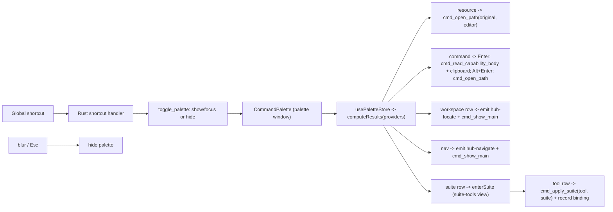

# Feature: Command Palette (Alfred-style)

Status: Implemented
Mode: Detailed
Owner: Arno
Last Updated: 2026-06-03
Depends On: [PRODUCT.md](../../PRODUCT.md), [ARCHITECTURE.md](../../ARCHITECTURE.md), [ARCHITECTURE.permissions.md](../../ARCHITECTURE.permissions.md)
Related Docs: [docs/tech/modules/tauri-ipc-contract.md](../tech/modules/tauri-ipc-contract.md), [docs/features/open-files.md](./open-files.md), [docs/tech/modules/suite-bindings.md](../tech/modules/suite-bindings.md)

## Why now

The manager and suites views are great once the app is open and focused, but the
fastest path to a capability is a global summon — type a few letters, hit Enter,
edit the file. This adds an Alfred-style floating command palette that works from
anywhere, plus the native macOS menu surface the app was missing.

## User story

As a user, I want to summon a search panel from any app with a global shortcut,
type to find a capability, and press Enter to open its original file in my editor
— without first surfacing and navigating the Hub window.

## Scope

### In scope

- A dedicated floating palette window (label `palette`): borderless, transparent,
  centered, hidden until summoned, dismissed on blur or Esc. On macOS it is a
  non-activating `NSPanel` so it floats over other apps' full-screen Spaces.
- A configurable global accelerator (default `Cmd+Alt+A`) that toggles it.
- Flat resource search: match by name, relative path, or source; Enter opens the
  original file (skill/hook marker file, or the agent/rule file itself) in the
  configured editor — reusing the same opener path as the manager row menu.
  Commands are excluded here — they have their own provider (below).
- Command search: match slash-command prompts by name/path/source. **Enter copies
  the command body to the clipboard** (for standalone paste into any tool);
  **Alt+Enter opens the source file** for editing. The body is read through
  `cmd_read_capability_body` (allowlist-gated, same as the opener) and written via
  the clipboard-manager plugin. See [commands.md](./commands.md).
- Workspace search: match inventory items across every remembered workspace (see
  [workspace-inventory.md](./workspace-inventory.md)); Enter *locates* the item —
  it focuses the Hub on Manager + Workspace scope, activates the owning workspace,
  and scrolls/highlights that row in the matrix (it does not open a file).
- An extensible command-provider registry. Root providers ship resource
  search, suite apply, and navigation (Open Manager / Suites / Config).
- A two-level suite-apply flow: search a suite by name, drill into it, then
  pick one tool to apply the suite to as a full reset (clean + replace every
  resource for that tool). The applied tool is bound to the suite so a later
  capability edit re-syncs it (see [suite-bindings.md](../tech/modules/suite-bindings.md)).
- Native top menus: App (About, Settings `Cmd+,`, Hide, Quit), Edit, View
  (Command Palette), Window. `Cmd+,` routes the main window to Config.
- A Config panel to edit the shortcut (validated, re-registered on save).

### Out of scope (registry extension points)

- Install-a-skill-from-vendor — left as a provider stub for later.
- Multi-tool apply in one step — the suite-tools view applies to one tool per
  Enter (the binding still re-syncs every bound tool on a capability edit).
- Fuzzy ranking / recency — v1 uses case-insensitive substring matching.
- Per-window themes — the palette reuses the app's dark tokens.

## How it works

- **Panel + shortcut (Rust).** `palette.rs` creates the hidden window at launch
  and owns `setup_palette` / `toggle_palette` / `hide_palette` /
  `register_palette_shortcut`. On macOS `setup_palette` subclasses the window to a
  non-activating `NSPanel` (via `tauri-nspanel`) with `FullScreenAuxiliary |
  CanJoinAllSpaces` collection behavior so it overlays full-screen apps without
  switching Spaces — standard `NSWindow` cannot ([tauri#11488](https://github.com/tauri-apps/tauri/issues/11488)).
  Panel objc ops run on the main thread (`run_on_main_thread`); non-macOS falls
  back to an always-on-top, all-workspaces window. The
  `tauri-plugin-global-shortcut` handler toggles the palette on key press; it
  hides on `WindowEvent::Focused(false)`. `macOSPrivateApi` is enabled so the
  window can be transparent.
- **Menu (Rust).** `menu.rs` builds the app menu and routes events: Settings ->
  show main + emit `menu-open-config`; Command Palette -> `toggle_palette`.
  `PredefinedMenuItem::quit` preserves Cmd+Q as the hard exit that bypasses the
  close-to-hide handler.
- **Settings.** `Settings.paletteShortcut` (default `Cmd+Alt+A`) persists in
  `~/.agentic-hub/config.json`. `cmd_save_settings` validates it via
  `is_valid_shortcut` and re-registers the accelerator; a bad saved value at
  launch falls back to the default so summon never breaks.
- **UI.** One bundle, two windows: `main.tsx` renders `<CommandPalette/>` when the
  window label is `palette`, else `<App/>`. `usePaletteStore` loads settings +
  scans + lists suites + scans every remembered workspace inventory on summon
  (`Promise.allSettled`, so one unreadable project never breaks summon), holds the
  query/selection and a `view` (`root` or `suite-tools`), and derives results from
  the registry in `components/palette/commands.ts`. Navigation commands emit
  `hub-navigate`; the main window listens and switches route. A suite row sets
  `dismissOnRun: false` and calls `enterSuite`, switching to the suite-tools
  view (a `‹ <suite>` breadcrumb, Backspace-on-empty steps back); each tool row
  there runs `applySuite(tool, suiteId)` and dismisses.
- **Workspace locate.** A workspace search row emits `hub-locate`
  (`{ workspaceId, itemId }`) then `cmd_show_main`. The main window's `App`
  listener switches the manager scope to `workspace`, routes to Manager, activates
  the owning workspace, and sets a transient `locateId` (the namespaced row id) in
  the matrix-filters store. The `Matrix` expands the row's ancestor folders,
  scrolls it into view, highlights it for ~2s, then clears the flag.

## Security

- The WebView holds no FS or opener scope. Resource opens go through the existing
  `cmd_open_path`, gated by `agentic_core::open_targets::is_openable`. Reading a
  command body for the clipboard uses `cmd_read_capability_body`, gated by the same
  allowlist, so the WebView can never read an arbitrary file.
- The global shortcut is registered from Rust; the palette capability grants only
  `core:default` plus its own window show/hide/focus and event emit/listen.
- `tauri-plugin-shell` is still never added.

## Acceptance criteria

- [ ] The configured shortcut (default `Cmd+Alt+A`) toggles the palette from any app.
- [ ] Typing filters resources by name/path/source; Enter opens the original file
      in the configured editor; the palette then hides.
- [ ] Typing also surfaces matching items from every remembered workspace; Enter on
      one focuses the Hub on Manager + Workspace scope, activates its workspace, and
      highlights that row in the matrix.
- [ ] Up/Down move the selection (wrapping); Esc and blur dismiss the palette.
- [ ] Navigation commands surface and focus the main window on the chosen route.
- [ ] `Cmd+,` opens Config; the app menu exposes Quit (hard exit) and Command Palette.
- [ ] Editing the shortcut in Config re-registers it; a malformed value is rejected
      with `invalid_shortcut`.

## Dependencies

- `tauri-plugin-global-shortcut` (Rust plugin + handler); `tauri` `macos-private-api`
  feature + `macOSPrivateApi: true` for transparency.
- New `Settings.paletteShortcut` + `agentic_core::settings::is_valid_shortcut`.
- New IPC commands `cmd_toggle_palette` / `cmd_show_main`; events `menu-open-config`
  / `hub-navigate`.
- New `palette` window + `capabilities/palette.json`.
- `src/components/palette/*`, `src/state/palette.ts`, shared `originalFile`/`editorApp`.
