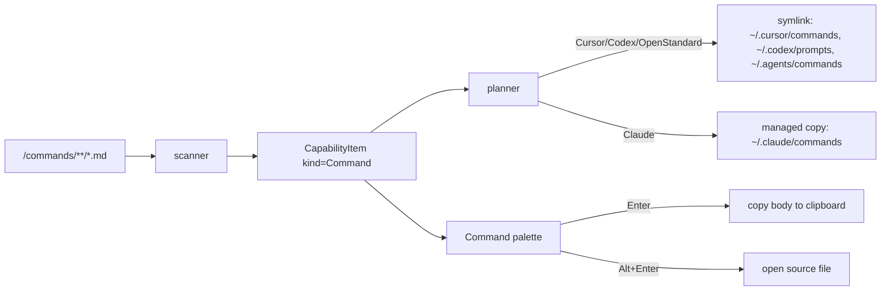

# Feature: Commands

Status: Implemented
Mode: Detailed
Owner: Arno
Last Updated: 2026-06-26
Depends On: [PRODUCT.md](../../PRODUCT.md), [ARCHITECTURE.projection.md](../../ARCHITECTURE.projection.md)
Related Docs: [docs/features/command-palette.md](./command-palette.md), [docs/tech/reference/tool-adapter-matrix.md](../tech/reference/tool-adapter-matrix.md)

## Why now

Cursor, Claude Code, and Codex all ship reusable slash-command prompts, each in
its own directory and format. Authoring them once and keeping every tool in sync
by hand is the same chore Agentic Hub already solves for skills, agents, and
rules. Commands become the fifth capability kind so a single prompt lives in the
shared root and projects into every tool that supports commands — and works
standalone via copy-to-clipboard for tools that don't.

## User story

As a user, I want to keep my slash-command prompts in `~/.agentic/commands/`,
organize them in folders, enable them per tool from the Hub, and summon any one
from the palette — Enter to copy it for a quick paste (or paste directly into
the focused app when **Paste into focused app** is on — macOS, Config), Alt+Enter
to edit it.

## Scope

### In scope

- A new `CapabilityKind::Command`: **file-based, nested markdown** under
  `<root>/commands/**/*.md` (same shape as agents/rules, not folder-with-marker
  like skills). Stable id `command:<relative_path>` (e.g.
  `command:review/code-review.md`).
- Projection into the tools that have a command concept:
  - **Cursor** `~/.cursor/commands` — symlink
  - **Codex** `~/.codex/prompts` — symlink
  - **OpenStandard** `~/.agents/commands` — symlink
  - **Claude** `~/.claude/commands` — managed copy (Claude's loader does not
    follow symlinks, like its skill loader)
  - **OpenClaw** — unsupported (no command concept)
- Always nested (no flat collapse); the source folder structure is preserved.
- Read-only workspace inventory: scans each tool's commands dir
  (`.cursor/commands`, `.claude/commands`, `.codex/prompts`) for nested `*.md`.
- Palette integration: a dedicated command provider. **Enter copies the body to
  the clipboard**; **Alt+Enter opens the source file** in the configured editor.
- A demo scaffold seed: `commands/review/code-review.md` and
  `commands/git/commit.md` ship in the bundled first-run tree.

### Out of scope

- Per-tool command formats / frontmatter rewriting — the markdown is projected
  verbatim. Tools that read frontmatter consume it as-is.
- A standalone "run command" action — the palette copies or opens; running a
  prompt is the tool's job.

## How it works

The kind flows through the existing scan → inspect → plan → apply pipeline for
free once the kind and per-tool adapter wiring exist:

- `CapabilityKind::Command` (`model.rs`): `dir_name = "commands"`,
  `id_prefix = "command"`, `marker_file = None`, `file_extensions = ["md"]`.
- `ToolSettings.commands_path` (`settings.rs`): per-tool default
  (`default_commands_path`); `None` for OpenClaw. Legacy configs missing the
  field fall back to the default in `adapter_registry::resolve`, so existing
  users get command projection without re-saving settings.
- `adapter_registry`: `layout_for(Command) = Nested`;
  `projection_mode_for`: `(OpenClaw, Command) => None`,
  `(Claude, Command) => FileSync`, `(_, Command) => LinkSync`;
  `base_path_for` / `target_path_for` route to `commands_path`.
- `open_targets`: `commands_path` is allowlisted so the palette can read/open
  command files.
- `workspace_inventory`: each tool's commands dir is scanned for nested `*.md`.

## Security

- Reading a command body for the clipboard goes through
  `cmd_read_capability_body`, gated by `agentic_core::open_targets::is_openable`
  — the WebView never reads arbitrary files.
- Clipboard writes use `tauri-plugin-clipboard-manager`
  (`clipboard-manager:allow-write-text` on the palette window only).
- `tauri-plugin-shell` is still never added.

## Acceptance criteria

- [ ] A markdown file under `~/.agentic/commands/` appears as a `command` row in
      the matrix, grouped under "Commands".
- [ ] Enabling a command for Cursor/Codex/OpenStandard creates a symlink in the
      tool's commands dir; for Claude, a managed copy.
- [ ] Nested folders are preserved on projection (no flattening).
- [ ] The palette lists commands on a query; Enter copies the body to the
      clipboard, Alt+Enter opens the source file.
- [ ] Workspace scope reports commands a project already has (read-only).
- [ ] First-run scaffold seeds at least one nested demo command.

## Dependencies

- Core: `CapabilityKind::Command`, `ToolSettings.commands_path`,
  `adapter_registry` wiring, `open_targets` + `workspace_inventory` updates.
- Shell: `tauri-plugin-clipboard-manager`, `cmd_read_capability_body`.
- UI: `KIND_ORDER`/`KIND_LABEL` + Matrix filter/badge, palette command provider,
  `runSelectedAlt`, `ipc.readCapabilityBody` / `ipc.copyText`.
