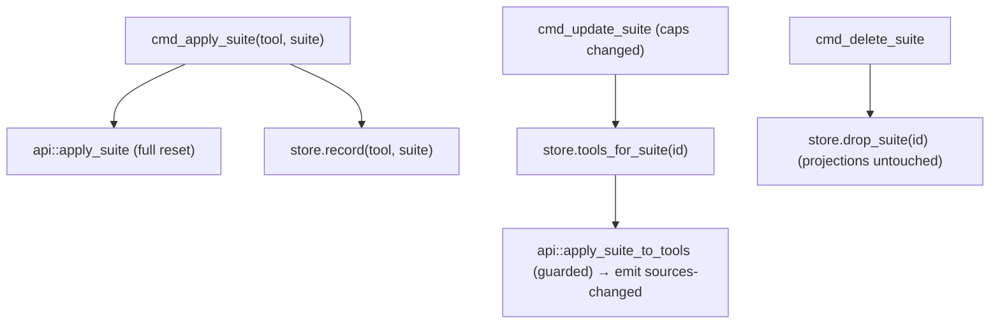

# Module: Suite ↔ Tool Bindings

Status: Implemented
Mode: Detailed
Owner: Arno
Last Updated: 2026-06-03
Depends On: [ARCHITECTURE.projection.md](../../../ARCHITECTURE.projection.md)
Related Docs: [docs/tech/modules/suite-presets.md](./suite-presets.md), [docs/tech/modules/tauri-ipc-contract.md](./tauri-ipc-contract.md), [docs/features/command-palette.md](../../features/command-palette.md)

## Purpose

Track which suite is currently applied to each tool in global scope, so that
editing a suite's capabilities automatically re-syncs every tool that suite was
applied to. Without this, applying a suite is a one-shot snapshot — a later
capability add/remove would silently drift from the tools.

## Model

```rust
pub struct SuiteBinding {
    pub tool_id: ToolId,
    pub suite_id: String,
}
```

One binding per tool. A suite apply is a **full reset** (`api::apply_suite`):
after it runs, a tool reflects exactly one suite's set. Re-applying a different
suite to the same tool replaces the prior binding (upsert by `tool_id`).

## Storage

`SuiteBindingStore` persists to `~/.agentic-hub/suite-bindings.json` — a new
dotfile alongside the workspace-target state, kept separate so the two stores
never contend:

```json
{ "version": 1, "bindings": [ { "toolId": "codex", "suiteId": "backend" } ] }
```

Contract (mirrors `WorkspaceTargetStore`):

- **Atomic writes** — write to `*.json.tmp`, then rename.
- **Missing file** → empty bindings (never an error).
- **Malformed file** → `StateParse` error; the file is **never overwritten**,
  so a hand-corrupted file is preserved for inspection.

API: `read()`, `record(tool, suite_id)` (upsert by tool),
`tools_for_suite(suite_id) -> Vec<ToolId>` (in `ToolId::ALL` order),
`drop_suite(suite_id)`.

## Lifecycle



- **Apply** (palette or Suites page): full-reset apply, then record the binding.
- **Update** (capability edit): re-apply the new suite to every bound tool as a
  full reset, serialized against the filesystem watcher via the reconcile guard
  (`watcher::with_reconcile_guard`) so the two never write the same tool dirs.
  Emits `sources-changed` so the main window refreshes.
- **Delete**: drop the suite's bindings only. Deleting a suite is not a
  destructive tool wipe — on-disk projections are left as they are.

## Scope boundary

This binding covers **global-scope** tools only. Workspace patches keep their
own per-workspace binding and watcher replay (see
[workspace-patch.md](./workspace-patch.md)); the two mechanisms do not overlap.

## Tests

- Core store (`suite_binding_store.rs`): record upserts per tool, re-record
  replaces, `tools_for_suite` filters and orders, `drop_suite` removes only its
  bindings, missing-file empty, malformed-not-overwritten.
- Apply accuracy (`api.rs`): re-apply with a smaller suite removes the dropped
  managed copy; rules block rewrites to exactly the suite set; hooks reflect the
  suite set; empty suite disables everything; stale managed copy refreshes;
  `apply_suite_to_tools` applies to each listed tool.
